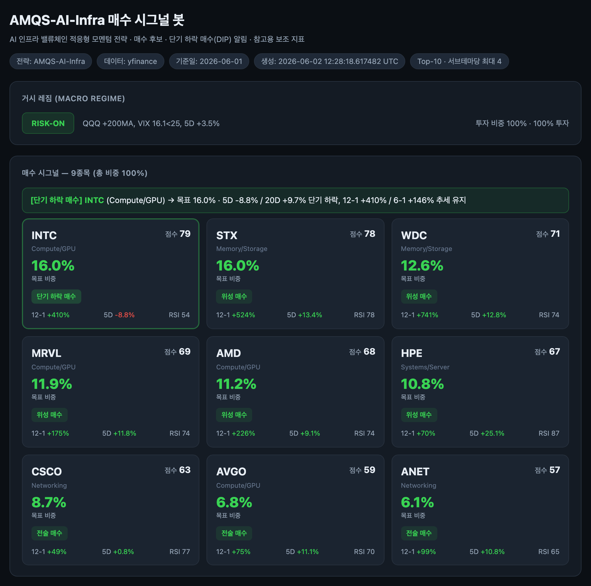

# 'AI 인프라 모멘텀 전략(AMQS-AI-Infra)' 전략 설명

> "잘 달리는 선수에게 베팅하되, 그 선수가 잠깐 넘어졌을 때 더 싸게 응원권을 산다. 그리고
> 날씨가 나빠지면 경기장을 빠져나온다." — 이 모멘텀 전략을 한 문장으로 줄이면 그렇습니다.

---

## 1. 이 글은 무엇을 설명하나요?

주식에 투자하는 방법은 아주 많습니다. 그중 하나가 '모멘텀(momentum) 투자'입니다. 이 글은
우리가 만든 AI 인프라(반도체·데이터센터) 종목용 모멘텀 전략인 'AMQS-AI-Infra'가 어떻게
작동하는지, 그리고 다른 흔한 방법들(QQQ, SMH, SOXX, AI-Infra 동가중)과 무엇이 다른지를
설명합니다.

투자는 때론 과감해야 하지만 계란을 한 바구니에 담는 일에 주의해야 합니다. 만일 2000년대 초에
닷컴 주식에 투자했다면 회복까지 엄청난 시간이 걸렸을 겁니다.

우리는 투자를 시작할 때 투자의 관점을 정하고 리스크와 한계를 정해야 합니다. 자신만의 철학이
없다면 주식 관련 작전방에 휘둘리고 큰 손실을 보게 될 수 있습니다.

배당주를 투자하는 것, 시장의 혁신에 투자하는 것 — 본인이 생각하는 투자 철학이 있어야
장기적으로 투자 철학에 맞게 투자를 할 수 있습니다. 맞지 않는 옷을 입고 레스토랑에 갈 수 없듯이
투자 전략은 깊이 관조해야 합니다.

이 투자 전략은 **파괴적 혁신과 그 모멘텀에 투자하는 전략**입니다. 인공지능과 인공지능 인프라에
집중하고, 엔비디아에서 그 주변 혁신 기업으로 시장의 모멘텀이 이동할 때 기회를 포착하고자 만들어진
전략입니다.

아래는 이 전략이 만들어 주는 '매수 시그널 대시보드' 화면입니다. 매일 어떤 종목을 얼마나 사면
좋을지 점수로 보여줍니다.

*AMQS-AI-Infra 매수 시그널 대시보드 (예시 화면)*

## 2. 모멘텀 투자란?

'모멘텀'은 '달리던 힘'이라는 뜻입니다. 운동장에서 빠르게 달리던 친구는 갑자기 멈추지 않고
한동안 계속 빠르게 달리죠. 주식도 비슷한 경향이 있습니다. 최근에 잘 오른 주식이 한동안 더 오르는
경우가 많다는 겁니다.

그래서 모멘텀 투자는 '요즘 잘 나가는 주식을 골라서, 계속 잘 나가는 동안 같이 타고 가는'
방법입니다. 눈사람을 만들 때 눈덩이가 한번 구르기 시작하면 점점 커지는 것과 비슷하다고 생각하면
됩니다.

물론 영원히 오르는 주식은 없습니다. 그래서 '언제 내려야 하는지(팔아야 하는지)' 규칙을 함께
정해 두는 것이 모멘텀 투자의 핵심입니다.

## 3. 꼭 알아야 할 용어 (쉬운 설명)

- **모멘텀(Momentum)**: 달리던 힘. 최근 많이 오른 주식이 더 오르는 경향을 이용하는 것.
- **12-1 모멘텀**: '지난 1년 성적'을 보되, 가장 최근 한 달은 빼고 봅니다. 최근 한 달은 너무
  들쭉날쭉해서 잠깐 헷갈리게 만들 수 있습니다. 그래서 한 달 전까지의 1년 흐름으로 '진짜 추세'를 봅니다.
- **6-1 / 3-1 모멘텀**: 같은 방식으로 각각 '최근 6개월', '최근 3개월' 흐름도 함께 봅니다. 여러
  기간을 같이 보면 더 명확한 흐름이 보입니다.
- **단기 하락 후 매수 (Pullback-in-Uptrend)**: 이 전략의 핵심! 잘 오르던 우등생이 '시험 한 번 못
  본 날'처럼 잠깐 주가가 빠졌을 때, 오히려 싸게 살 기회로 봅니다. 단, 진짜로 추세가 살아 있을
  때만 가능한 전략입니다.
- **거시 레짐 (Macro Regime)**: 시장 전체의 '날씨'. 맑으면(Risk-On) 평소대로 다 투자, 흐리면
  (Risk-Off) 절반만 투자하고 절반은 현금, 폭풍우(Defensive)면 안전한 곳으로 대피합니다.
- **손절 (Stop Loss)**: 산 가격에서 -12% 떨어지면 미련 없이 파는 안전벨트. 더 큰 손해를 막아줍니다.
- **리밸런싱 (Rebalancing)**: 일주일에 한 번, 가방을 다시 싸듯 어떤 종목을 얼마나 담을지 새로 정하는 것.
- **변동성 (Volatility)**: 주가가 얼마나 '출렁이는지'. 출렁임이 크면 마음 졸일 일이 많습니다.
- **MDD (최대 낙폭)**: 가장 높았던 순간부터 가장 많이 떨어졌던 폭. 롤러코스터에서 가장 크게
  떨어지는 구간이라고 보면 됩니다. 작을수록 덜 무섭습니다.
- **샤프 지수 (Sharpe)**: '출렁임에 비해 얼마나 잘 벌었나'를 나타내는 점수. 멀미를 적게 하면서
  멀리 갔으면 높은 점수예요. 보통 1보다 크면 괜찮은 편입니다.
- **Top-N 선별 + 서브테마 분산**: 점수가 높은 상위 10개만 골라 삽니다. 단, 'GPU' 같은 한 분야에
  4개까지만 담습니다. '계란을 한 바구니에 담지 말라'는 원칙입니다.

## 4. 이 전략의 핵심 메시지 '단기 하락 후 매수'

보통의 단순한 모멘텀 전략은 주가가 조금만 떨어져도 '안 좋아졌네' 하고 팔아버립니다. 하지만 잘
달리던 선수가 돌부리에 한 번 걸렸다고 탈락시키면 아깝겠죠?

그래서 이 전략은 4가지 조건을 모두 만족할 때에만 '이건 떨어진 게 아니라 잠깐 쉬어가는 거다,
오히려 싸게 살 기회다'라고 판단합니다.

1. 지난 1년 흐름(12-1)이 위로 향한다 → 큰 추세가 살아 있다
2. 지난 6개월 흐름(6-1)도 위로 향한다 → 중간 추세도 살아 있다
3. 지금 가격이 '50일 평균선' 위에 있다 → 무너진 게 아니라 건강한 조정이다
4. 최근 5일 또는 20일 동안 의미 있게 빠졌다 → 살 만큼 싸졌다

위 화면에서 INTC(인텔)가 바로 그런 경우였습니다. 지난 1년은 +410%나 올랐는데(추세 살아 있음),
최근 5일은 -8.8% 빠졌어요(잠깐 조정). 그래서 '단기 하락 후 매수' 신호가 켜진 겁니다. 반대로
추세가 무너진 종목(예: 1년 내내 떨어진 종목)은 아무리 싸도 사지 않습니다. 떨어지는 칼을 맨손으로
잡지 않는 겁니다.

## 5. 다른 방법들과 비교해 볼까요?

같은 'AI·반도체'에 투자해도 방법이 여러 가지입니다. 자주 비교되는 4가지를 먼저 쉬운 말로
설명하겠습니다.

- **QQQ**: 미국 대표 큰 기술회사 100개를 한 번에 담은 묶음 상품(ETF). 애플·마이크로소프트 같은
  큰 회사가 많아 비교적 '안정적'이고 덜 출렁입니다.
- **SMH / SOXX**: '반도체 회사들'만 모은 묶음 상품(ETF). AI 붐을 잘 타서 많이 오르지만, 그만큼
  더 화끈하게 출렁입니다. (두 상품은 비슷한데 담는 회사·비중이 조금 다릅니다.)
- **AI-Infra 동가중 전략**: 제가 고른 19개 AI 인프라 종목을 '똑같은 비중으로 전부' 사는 방법.
  고르지 않고 다 담습니다. 강세장에서는 이게 제일 단순하고 셉니다. 시장이 좋을 때는 같은 테마에
  묶인 섹터가 다 오르기 때문에 쉽고 강력합니다.
- **AMQS-AI-Infra (이 전략)**: 각 주식의 점수를 매겨 좋은 10개만 골라 사고, 위험하면 팔고(손절),
  날씨가 나쁘면 현금으로 도피합니다. '고르고 + 지키는' 방법입니다.

아래는 2024년 1월부터 2026년 5월까지(약 2년 5개월) 실제 데이터로 돌려본 결과입니다. 숫자는
'이만큼 벌었다'가 아니라 '과거에 이랬다'는 참고용입니다.

| 방법 | 총수익 (많을수록↑) | 샤프 (높을수록 좋음) | 최대낙폭 MDD (0에 가까울수록 덜 무섭) | 한마디 설명 |
|---|---:|---:|---:|---|
| **AMQS-AI-Infra (이 전략)** | **+168%** | **1.46** | **-27%** | 골라서 사고 위험 관리 |
| QQQ | +83% | 1.33 | -23% | 가장 안정적·덜 출렁 |
| SMH (반도체) | +245% | 1.60 | -36% | 반도체 집중, 화끈 |
| SOXX (반도체) | +201% | 1.40 | -41% | 반도체 집중, 낙폭 큼 |
| AI-Infra 동가중 | +403% | 2.01 | -37% | 다 사기, 강세장 최강 |

이 표를 중학생 눈높이로 풀면 이렇습니다:

- '그냥 다 사기(AI-Infra 동가중 투자)'가 돈은 제일 많이 벌었습니다(+403%). 왜냐하면 2024~2026년은
  AI 주식이 거의 다 같이 오른 '초강세장'이었습니다. 이럴 땐 안 고르고 다 사는 게 유리합니다.
- 제가 만든 모멘텀 투자 전략(AMQS-AI-Infra)은 '안전한 QQQ(+83%)'보다 두 배 넘게 벌었습니다(+168%).
  시장 평균보다 훨씬 잘한 겁니다.
- 그리고 반도체 ETF(SMH·SOXX)보다 '덜 떨어졌습니다'. 최대낙폭이 -27%로, SMH(-36%)·SOXX(-41%)보다
  롤러코스터가 덜 무서웠습니다. 위험할 때 팔고 현금으로 피한 효과입니다.

즉 이 전략의 진짜 매력은 '제일 많이 버는 것'이 아니라, '비슷하게 벌면서 덜 무섭게(덜 떨어지게)
가는 것'입니다.

폭우가 오면 잠시 도피했다가 날이 개면 진창에 빠지지 않고 길을 나서는 전략이 지금 이 AI 인프라
모멘텀 전략입니다.

## 6. 이 전략의 장점

- 시장 평균(QQQ)보다 훨씬 높은 수익을 냈습니다(+85%포인트 더). 반도체 ETF보다 덜 떨어집니다.
  손절(-12%)과 '날씨가 나쁘면 현금으로 피하기' 규칙 덕분입니다.
- 감정이 아니라 규칙이 결정합니다. 무서울 때 충동적으로 팔거나, 욕심나서 무리하게 사는 실수를
  줄여줍니다. 한 분야에 몰빵하지 않습니다(서브테마 분산). GPU만 잔뜩 사는 위험을 막습니다.
- '단기 하락 후 매수'로 좋은 종목을 더 싼 가격에 담을 기회를 노립니다.

## 7. 이 전략의 단점

- 모두가 오르는 초강세장에서는 '그냥 다 사기(동가중)'보다 수익이 낮습니다. 고르고 지키느라 일부
  상승을 놓칩니다.
- 매주 사고팔기 때문에 거래가 아주 잦습니다(회전율 매우 높음). 수수료·세금이 많이 들어 실제
  수익이 깎일 수 있습니다. 과거(강세장) 데이터에 맞춰 나온 결과라, 미래에도 똑같이 된다는 보장이
  없습니다. 담는 종목이 전부 'AI 인프라'라 서로 비슷합니다. 이 분야가 흔들리면 여러 종목이
  한꺼번에 떨어질 수 있다는 단점이 존재합니다.
- 다만, ChatGPT를 비롯한 LLM이 전체 산업에서 1% 내외 도입이 되었고 앞으로 몇 년간 수익, 숫자를
  증명하며 성장할 것이기에 가능한 전략입니다.

## 8. 꼭 알아야 할 리스크(위험) 요소

- **높은 출렁임** — AI·반도체 주식은 시장보다 더 크게 오르내립니다. 마음 졸일 일이 많습니다.
- **타이밍 위험** — '날씨가 나쁘다'고 판단하는 게 한 박자 늦으면, 피하기 전에 이미 많이 떨어질 수
  있습니다.
- **과적합 위험** — 과거에 잘 맞던 규칙(점수 기준)이 미래엔 안 맞을 수 있습니다. 그래서 계속
  점검·보정이 필요합니다.
- **비용 갉아먹기** — 자주 거래하면 수수료·세금·환전 비용이 쌓여 수익을 줄입니다. 특히 개인
  투자자는 더 그렇습니다.
- **버블 위험** — AI 열풍이 식으면, 비슷한 종목들이 동시에 크게 빠질 수 있습니다.
- 정리하면: 이 전략은 '참고용 도구'이지 '돈 버는 보증서'가 아닙니다.

## 9. 한 문장 요약

AMQS-AI-Infra는 '잘 달리는 AI 인프라 주식을 점수로 골라 타되, 잠깐 넘어졌을 때 더 싸게 담고,
위험 신호가 오면 규칙에 따라 팔거나 현금으로 피하는' 전략입니다. 강세장에서 '무조건 다 사기'만큼
많이 벌지는 못해도, 더 적게 떨어지면서 시장 평균은 크게 앞섰습니다. 다만 모든 숫자는 과거 기록일
뿐, 미래를 보장하지 않습니다.

---

*면책: 이 글은 공부·이해를 돕기 위한 교육용 설명이며, 특정 종목을 사라거나 팔라는 권유가
아닙니다. 투자에는 원금 손실 위험이 있고, 모든 결정과 그 결과의 책임은 투자자 본인에게 있습니다.*

---

### 전체 전략과 소스 코드

- [AMQS-AI-Infra 전략 전체](https://github.com/gameworkerkim/vibe-investing/tree/main/01.Trading%20Strategy/Adaptive%20Momentum%20Quant%20Strategy%20(AMQS)%20for%20AI%20Infra)
- [vibe-investing 레포지토리](https://github.com/gameworkerkim/vibe-investing)
- PDF 버전: [AMQS_AI_Infra_Idea_Note.pdf](AMQS_AI_Infra_Idea_Note.pdf)
