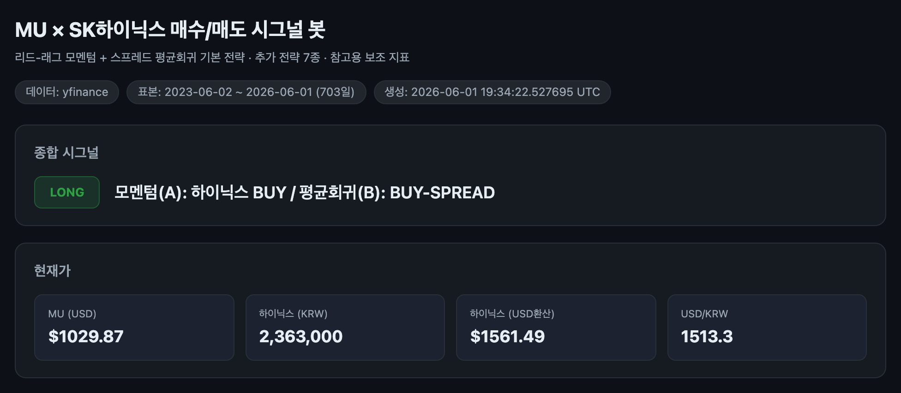
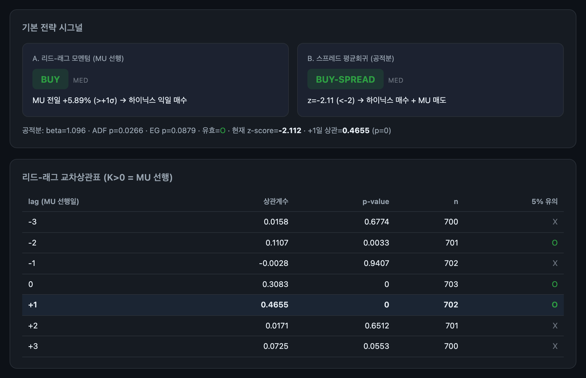
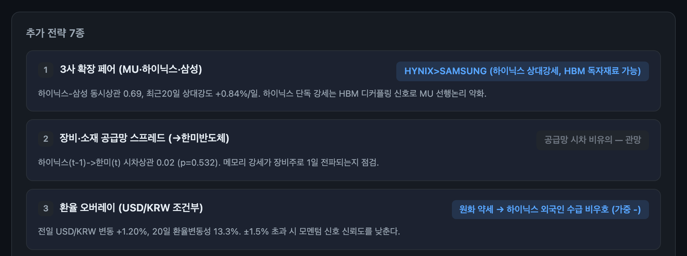

# 마이크론이 오르면 다음 날 하이닉스도 오를까 — 직관을 봇으로 검증하다

### 두 메모리 대장주의 시차(時差)를, 상관계수와 백테스트와 시그널 봇으로 끝까지 따라가 본 기록

> 상관(correlation)은 분명하다. 그러나 "다음 날 사라"는 규칙으로 곧장 번역되지는 않는다.
> 직관을 거래 가능한 신호로 바꾸는 일은, 느낌이 아니라 계산이 한다.

---

## 1. 하나의 장면에서 시작된 질문

2026년 5월 26일(현지시간), 마이크론 테크놀로지(MU) 주가가 하루 만에 약 20% 폭등했다.
UBS가 목표주가를 세 배 가까이 올린 것이 방아쇠였다. 그리고 **그 다음 날** 한국 증시에서
SK하이닉스가 9% 넘게 뛰며 사상 처음 시가총액 1조 달러를 넘어섰다. 국내 언론은 이를
"마이크론발(發) 주가 훈풍"으로 설명했다.

투자자라면 자연스럽게 묻게 된다. **마이크론이 오르면, 하이닉스가 다음 날 오르는 패턴이
실제로 존재하는가?** 이 질문은 데이터로 답할 수 있고, 또 데이터로만 답해야 한다. 그래서
이번에는 직관에서 멈추지 않고, 그 직관을 **상관계수 → 공적분 → 백테스트 → 시그널 봇**까지
끝까지 밀어붙여 보았다.

## 2. 쉬운 절반 — 상관은 분명하다

마이크론·SK하이닉스·삼성전자는 글로벌 메모리 반도체를 사실상 3분하는 과점 사업자이고,
DRAM·NAND, 그리고 HBM이라는 동일한 수요·가격 사이클에 함께 노출돼 있다. AI 데이터센터발
메모리 수요 폭증 국면에서 최근 1년 주가 상승률은 SK하이닉스 약 1,007%, 마이크론 약 859%에
달했다. 같은 방향, 비슷한 크기로 움직였다.

즉 **장기 사이클 차원에서 둘의 동조화는 구조적**이다. 여기까지는 누구나 안다.

## 3. 어려운 절반 — '다음 날'의 실체, 시차가 만드는 선행성

핵심은 두 번째 질문이다. 단순 동조를 넘어, **마이크론이 하이닉스를 하루 선행하는가?**

그럴듯한 메커니즘이 있다. 미국 증시는 한국 증시가 마감한 *이후* 열린다. 따라서 마이크론의
당일(t일) 종가에 담긴 정보 — 실적, 가이던스, 투자은행 목표가 상향 같은 충격 — 은 그 시점에
이미 거래를 마친 하이닉스에는 **다음 거래일(t+1)에야** 반영된다. 구조적으로 마이크론이 한국
메모리주의 하루 선행지표가 될 여지가 생긴다.

이 가설을 3년치 일봉으로 직접 계산했다. 결과는 선명했다.

| lag (MU 선행일) | 상관계수 | p-value | 유의 |
|---:|---:|---:|:---:|
| 0 (동시점) | 0.308 | 0.000 | O |
| **+1 (MU 하루 선행)** | **0.466** | **0.000** | **O** |

**MU가 하루 선행하는 +1일 상관(0.466)이 동시점 상관(0.308)보다 강하다.** 시차 가설이
데이터에서 그대로 확인된 것이다. "어제 마이크론이 움직였으니 오늘 하이닉스를 보라"는 직관에는
통계적 근거가 있었다.

## 4. 상관을 넘어 — 공적분과 평균회귀

상관이 있다고 곧장 페어트레이딩이 되는 것은 아니다. 평균회귀(한쪽이 과도하게 벌어지면
좁혀지는) 베팅을 하려면 두 가격이 장기적으로 함께 묶여 있는지(공적분)를 검정해야 한다.
통화도 맞춰야 한다 — 하이닉스는 원화, 마이크론은 달러다.

하이닉스를 달러로 환산해 회귀하니 헤지비율 beta는 1.10, 잔차의 ADF 검정은 p=0.027로 평균회귀
페어가 성립했다(단, Engle-Granger 검정은 0.088로 경계선 — 공적분은 강건하지 않다). 그렇게 만든
스프레드의 z-score가 현재 **-2.1** 부근이다. 이는 하이닉스가 마이크론 대비 일시적으로
저평가된, 스프레드 매수 구간이라는 뜻이다.

## 5. 백테스트 — 숫자를 곧이곧대로 믿지 말 것

리드-래그 모멘텀과 스프레드 평균회귀, 두 신호를 거래비용(편도 5bps)과 룩어헤드 제거를
전제로 3년 백테스트했다.

| 전략 | CAGR | Sharpe | MaxDD | 판정 |
|---|---:|---:|---:|---|
| 리드-래그 롱숏 | 390.9% | 4.54 | -10.3% | 유의미 |
| 리드-래그 롱플랫 | 145.4% | 3.21 | -10.3% | 유의미 |
| 바이앤홀드(하이닉스) | 142.8% | 1.81 | -43.1% | 유의미 |
| 평균회귀 페어 | 69.3% | 1.44 | -24.6% | 유의미 |

수치는 화려하지만, 여기서 분석가의 규율이 필요하다. **이 표본 구간은 사상 최대의 메모리
강세장이다.** 바이앤홀드만으로도 Sharpe 1.8이 나오는 국면에서, 모멘텀 전략이 강세장 방향에
올라타 수치가 부풀려졌을 가능성이 크다. 공적분도 강건하지 않고, 유의성 판정은 "표본 내에서
우연이 아니다"까지만 말할 뿐 미래 수익을 보장하지 않는다.

그래서 이 백테스트가 확실히 보여주는 것은 **수익률의 크기가 아니라 방향성 두 가지**다.
(1) MU가 하이닉스를 하루 선행하는 시차 구조가 실재한다. (2) 두 가격이 단기적으로 평균회귀하는
스프레드가 존재한다. 이 두 구조는 강건하고, 수익률 절댓값은 강건하지 않다.

## 6. 직관을 봇으로 — 매수/매도 시그널 봇

여기까지 검증한 신호를 매일 자동으로 계산하도록 **시그널 봇**으로 만들었다. 파이썬으로
데이터를 받아 기본 전략 두 가지(A 모멘텀 / B 평균회귀)와 추가 전략 7종을 한 번에 산출하고,
간단한 웹뷰 대시보드로 보여준다.

대시보드 상단은 한눈에 들어온다. 현재 종합 시그널은 **LONG** — 모멘텀(A)이 하이닉스 BUY,
평균회귀(B)가 BUY-SPREAD를 가리킨다. MU가 전일 +1σ를 넘겨 급등했고, z-score가 -2.1로
저평가 구간이기 때문이다.

기본 전략 카드는 신호의 *근거*를 함께 보여준다. 결론(BUY)보다 근거(공적분 통계량, 교차상관표)를
먼저 보이는 것이 이 도구의 원칙이다. +1일 상관 0.466이 굵게 강조돼 있다.

## 7. 추가 전략 7종 — 하나의 신호를 여러 각도에서

단일 신호는 깨지기 쉽다. 그래서 같은 데이터 위에서 신호를 교차 검증하는 보조 전략 7종을
함께 얹었다.

1. **3사 확장 페어(MU·하이닉스·삼성).** 하이닉스-삼성 상대강도로 HBM 디커플링을 탐지한다.
   하이닉스 단독 강세는 마이크론 선행 논리를 약화시키는 신호다.
2. **장비·소재 공급망 스프레드(→한미반도체).** 메모리 강세가 장비주로 하루 전파되는지 점검.
3. **환율 오버레이(USD/KRW).** 환율 급변·원화 강약으로 모멘텀 신뢰도와 외국인 수급 가중을 조정.
4. **변동성 타겟팅 / 포지션 사이징.** 실현변동성 역가중으로 강세장 막바지 급락 리스크를 완화.
5. **이벤트 드리븐 오버레이.** MU 실적 ±3거래일은 진입 게이트를 닫는다.
6. **레짐 스위칭(60일선).** 추세장이면 모멘텀, 엇갈리면 평균회귀, 약세장이면 방어로 비중 배분.
7. **옵션 기반 표현.** 한국 시장의 공매도·대차 제약을 풋/콜 스프레드로 우회한다.

## 8. 그래서 어떻게 쓰나 — 다양한 전략적 가능성

실전의 포인트는 의외로 절제돼 있다. 봇이 제시하는 시그널은 *지시*가 아니라 *가설의 현재 상태*다.

- **MU 상승 → 하이닉스 익일 매수.** 단, 평범한 등락이 아니라 실적·대형 목표가 조정 같은
  **촉발 이벤트**가 있을 때 집중 적용한다.
- **MU 하락 시그널 → 하이닉스 매도/축소.** MU의 야간 급락은 한국 메모리주에 대한 가장 빠른
  경고다. 공매도가 어렵다면 보유 비중 축소나 헤지가 현실적이다.
- **하이닉스 저평가(z<-2) → 스프레드 매수**, **고평가(z>+2) → 매도(소량·타이트 손절).**
  실제로 강세장에서는 하이닉스를 매도하는 쪽이 불리했다.
- **디커플링을 항상 확인하라.** 하이닉스 단독 HBM·엔비디아 호재가 주도하는 날은 MU 선행
  논리가 무력화된다.

## 9. 맺으며 — 도구는 계산하라고 있는 것이지 점치라고 있는 것이 아니다

첫 질문에 대한 답은 명확한 "그렇다"이고, 두 번째 질문에 대한 답은 **"조건부로 그렇다 —
촉발 이벤트 중심으로, 그리고 디커플링이 없을 때"**이다. 마이크론은 한국 메모리주의 선행지표가
될 수 있지만, 그것을 자동매매 규칙으로 바꾸는 일은 별도의 통계적 증명을 요구한다.

이번 작업의 진짜 결론은 특정 매수·매도 신호가 아니다. **직관 → 통계 → 백테스트 → 봇**으로
이어지는 검증의 파이프라인 그 자체다. LLM이든 사람이든, 상관계수를 "느낌으로" 추정하는 순간
분석은 무너진다. 모든 수치는 인샘플 특성과 레짐 의존성을 품고 있으며, 그대로 미래에 작동한다는
보장은 어디에도 없다. 그래서 이 글의 모든 신호는 참고용이고, 실제 투자에는 상당한 리스크가
따른다.

---

*면책: 본 칼럼은 공개 자료와 통계적 관점에 기반한 분석이며 특정 종목의 매매를 권유하지
않는다. 모든 투자 판단과 그 결과의 책임은 투자자 본인에게 있다.*

---

### 링크

- 레포지토리: [vibe-investing](https://github.com/gameworkerkim/vibe-investing)
- 이 전략 전체: [MU_Hynix](https://github.com/gameworkerkim/vibe-investing/tree/main/01.Trading%20Strategy/Awesome%20claude%20quant%20scripts/MU_Hynix)
- 시그널 봇: [MU_Hynix/Signal_Bot](https://github.com/gameworkerkim/vibe-investing/tree/main/01.Trading%20Strategy/Awesome%20claude%20quant%20scripts/MU_Hynix/Signal_Bot)
- 백테스트 결과: [MU_Hynix/result](https://github.com/gameworkerkim/vibe-investing/tree/main/01.Trading%20Strategy/Awesome%20claude%20quant%20scripts/MU_Hynix/result)

---

*Part of [`vibe-investing`](https://github.com/gameworkerkim/vibe-investing) ·
maintained by HoKwang Kim (Dennis)*
