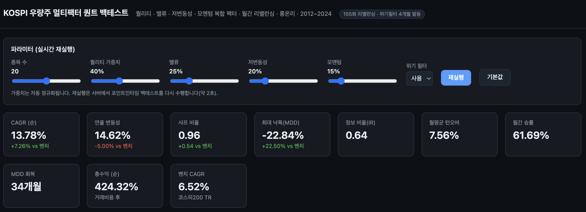
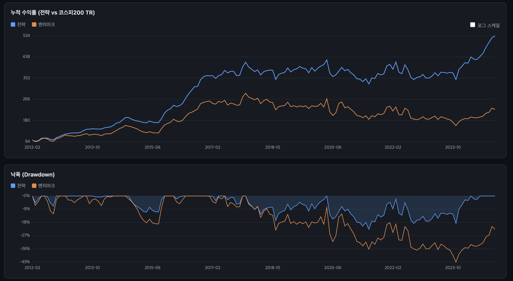
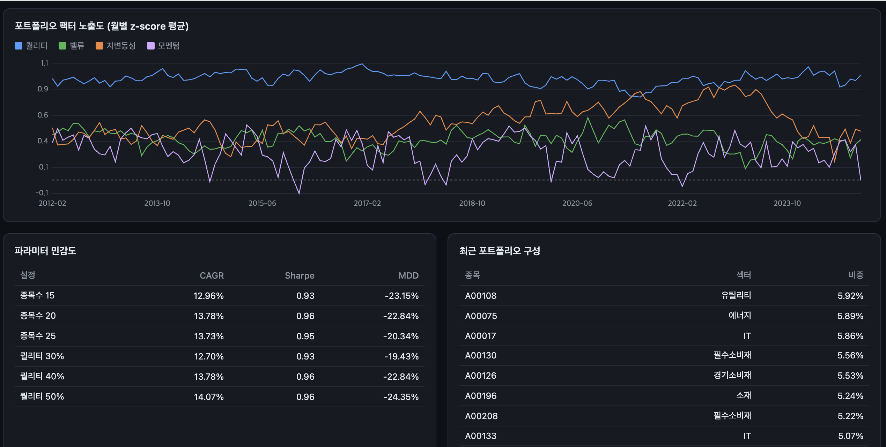

# 코스피 우량주 멀티팩터 퀀트 백테스트 & 대시보드

[`BuyKorea.md`](../BuyKorea.md)의 **코스피 우량주 중심 롱온리 퀀트 트레이딩 전략** 프롬프트를 검증하기 위한 백테스팅 엔진과 웹 대시보드입니다. **Node.js + TypeScript** 로 구현했습니다.

> ⚠️ 포함된 데이터는 전략 로직 검증용 **합성(synthetic) 데이터**이며 실제 시장 데이터가 아닙니다. 어떤 백테스트도 미래 수익을 보장하지 않습니다.

---

## 대시보드 미리보기

성과 요약 카드 · 누적 수익률 곡선(전략 vs 코스피200 TR) · 파라미터 실시간 재실행 컨트롤



낙폭(Drawdown) · 연도별 수익률 · 팩터별 RankIC 진단



포트폴리오 팩터 노출도 · 파라미터 민감도 · 최근 포트폴리오 구성



> 위 스크린샷은 합성 데이터 기준 예시입니다. 참고 성과(순, 거래비용 후): CAGR 약 13.8% vs 벤치마크 6.5%, 샤프 0.96 vs 0.42, MDD −22.8% vs −45.4%.

---

## 전략 요약

퀄리티 · 밸류 · 저변동성 · 모멘텀의 복합 팩터로 코스피200 우량주를 선별하는 월간 리밸런싱 롱온리 전략입니다.

| 팩터군 | 가중치 | 지표 |
|---|---|---|
| 퀄리티 | 40% | ROE, GP/A, 부채비율(역), ROE 안정성(역) |
| 밸류 | 25% | E/P, B/P, 배당수익률 |
| 저변동성 | 20% | 60일 실현변동성(역), 시장 베타(역) |
| 모멘텀 | 15% | 12-1개월, 6-1개월 |

핵심 구현 원칙은 **look-ahead bias 제거**(포인트인타임 재무·구성종목)와 **현실적 거래비용/위험관리** 입니다.

---

## 이 전략의 장점 / 단점

### 장점

- **하방 방어력**: 저변동성·퀄리티 팩터가 하락장에서 낙폭을 크게 줄입니다(백테스트 MDD −22.8% vs 벤치 −45.4%). 위기 필터(지수 12개월 이동평균 하회 + 60일 실현변동성 30% 이상 → 주식 50% 축소)가 극단적 국면을 추가로 완충합니다.
- **높은 위험조정 수익**: 여러 팩터가 서로 다른 국면에서 작동해 샤프·정보비율이 개선됩니다(샤프 0.96 vs 0.42).
- **한국 시장 특화**: 재벌·대형주 쏠림, 강한 저변동성 효과, 배당+저변동성 중첩, 12-1개월 모멘텀 등 코스피 고유 구조를 직접 반영합니다.
- **가치 함정 회피**: 단순 저PBR/저PER 대신 수익성(ROE·GP/A)·재무건전성으로 먼저 스크리닝하는 '퀄리티 밸류' 접근.
- **낮은 턴오버·비용**: Buffer rule(20위 진입/30위 이탈)과 리밸런싱 밴드로 불필요한 매매를 줄여 월평균 one-way 턴오버 약 8%.
- **투명성·재현성**: 전 과정이 포인트인타임으로 검증 가능하고 난수 시드가 고정되어 결과가 재현됩니다.

### 단점 / 리스크

- **강세장 소외(베타 갭)**: 저변동성 틸트로 포트폴리오 베타가 1보다 낮아, 지수가 급등하는 국면에서는 벤치마크에 뒤처질 수 있습니다.
- **팩터 부진 구간**: 밸류·모멘텀은 수년간 언더퍼폼하는 국면이 존재하며, 이때 복합 전략도 정체될 수 있습니다.
- **데이터 의존성**: 포인트인타임 재무·히스토리컬 코스피200 구성종목·상장폐지 데이터가 없으면 백테스트 신뢰성이 급락합니다(생존 편의·look-ahead 위험).
- **유니버스 협소**: 코스피200 우량주로 제한해 중소형주 알파를 포기하며, 소수 대형주 집중 리스크가 남습니다.
- **거시·환율 민감**: 원/달러 환율, 외국인·기관 수급, 글로벌 경기 사이클에 노출됩니다.
- **정책 리스크**: 증권거래세율이 정책적으로 변동하므로 비용 가정을 지속 갱신해야 합니다.
- **과최적화 위험**: 가중치·종목수 등 파라미터 튜닝이 과적합으로 이어질 수 있어, 총수익보다 RankIC 안정성과 아웃오브샘플 검증이 우선입니다.

---

## 미국 S&P 500 대비 장단점

동일한 멀티팩터 접근을 **코스피(KOSPI)** 에 적용할 때와 **S&P 500(미국)** 에 적용할 때의 상대적 특성 비교입니다.

| 구분 | 코스피 우량주 멀티팩터 (본 전략) | S&P 500 멀티팩터 |
|---|---|---|
| 저변동성 팩터 강도 | **매우 강함** — 한국에서 역사적으로 프리미엄이 큼 | 존재하나 상대적으로 약함 |
| 밸류/배당 프리미엄 | 강함, 단 '가치 함정' 빈번 → 퀄리티 필터 필수 | 존재하나 2010년대 성장주 랠리로 장기 부진 경험 |
| 시장 자체 장기 수익 | 상대적으로 낮음(박스권 경향) → **알파 필요성이 큼** | **구조적으로 높음** — 지수 자체가 강력한 벤치마크 |
| 벤치마크 이기기 난이도 | 상대적으로 낮음(지수 정체 → 팩터 초과수익 여지 큼) | **높음** — 지수(패시브)가 이미 강해 초과수익 어려움 |
| 대형주 쏠림 | 삼성전자 등 소수 초대형주 집중 | 상위 소수 빅테크 집중(쏠림은 유사) |
| 환율/거시 민감도 | 원화·수출·외국인 수급에 **크게** 민감 | 기축통화·내수 비중 커 상대적으로 낮음 |
| 유동성·지배구조 | 중소형주 유동성·지배구조 리스크 큼 → 우량주 제한 | 유동성 풍부, 공시·회계 신뢰성 높음 |
| 거래비용·세금 | 증권거래세 존재(매도), 정책 변동 | 거래세 없음, 스프레드 낮음 → **비용 유리** |
| 데이터 접근성 | 포인트인타임/구성종목 데이터 확보 어려움 | 데이터·툴 생태계 풍부 |
| 요약 | **하방 방어 + 정체장 알파**에 강점, 강세장·환율에 취약 | **지수 자체가 강해** 초과수익은 어렵지만 절대수익·비용·데이터에서 유리 |

**정리:** 코스피는 지수 장기 수익이 낮고 저변동성 효과가 강해 *팩터 기반 초과수익(알파)*의 여지가 크지만 환율·수급·데이터 제약이 큽니다. 반대로 S&P 500은 지수 자체가 매우 강력해 *패시브 대비 초과수익을 내기 어렵지만* 절대수익, 낮은 거래비용, 우수한 데이터 환경이 장점입니다. 실무에서는 두 시장을 병행해 지역 분산과 팩터 분산을 동시에 얻는 접근이 유효합니다.

---

## 실행 방법

```bash
npm install        # 의존성 설치
npm run gen-data   # 합성 KOSPI200 데이터 생성 (data/*.csv)
npm run backtest   # 백테스트 실행 → 터미널 리포트 + out/ 산출물
npm run dashboard  # 대시보드 서버 → http://localhost:3000
```

한 번에: `npm start` (데이터 생성 → 백테스트 → 대시보드).
타입 체크: `npm run typecheck`.

---

## 대시보드

`http://localhost:3000`

- 누적 수익률 곡선 (전략 vs 코스피200 TR, 로그 스케일 토글)
- 낙폭(Drawdown) 곡선
- 연도별 수익률 (차트 + 표)
- 팩터별 평균 RankIC 차트 · IC 분석표(평균 IC / IC_IR / t-통계량 / 승률)
- 포트폴리오 팩터 노출도 시계열
- 파라미터 민감도 표
- 최근 포트폴리오 구성 내역
- **인터랙티브 컨트롤**: 종목 수 · 팩터 가중치 · 위기 필터를 바꿔 서버에서 실시간 재백테스트

차트는 외부 CDN/라이브러리 없이 순수 canvas 로 렌더링합니다.

---

## 구현 사양 (BuyKorea.md 대응)

| 항목 | 구현 |
|---|---|
| 재무 데이터 시점 | 공시 지연 반영 (분기 +45일, 사업보고서 +90일), TTM 환산 |
| 유니버스 | 시점별 코스피200 구성종목, 금융 제외, 상장 12개월 미경과·관리·거래정지·자본잠식 제외, 유동성 필터(20일 평균 거래대금 50억) |
| 팩터 표준화 | 상하위 1% winsorize → z-score → 결측치 중앙값 대체 |
| 종합 점수 | WICS 섹터 내 percentile rank → 팩터군 가중합 (섹터 중립화) |
| 종목 선정 | Buffer rule (20위 진입 / 30위 이탈), 섹터 집중 한도 35% |
| 리밸런싱 | 월말 신호, 다음 영업일 시가 체결, 동일 비중, ±1%p 밴드, 8% 초과 시 축소 |
| 거래 비용 | 증권거래세(연도별 파라미터화), 매매 수수료 0.015%, 시장 충격 10bp |
| 위험 관리 | 위기 필터(지수 12M 이동평균 하회 + 60일 실현변동성 30% 이상 → 주식 50% 축소) |
| 검증/진단 | 팩터별 IC/RankIC 시계열·t통계량, 팩터 노출도, 파라미터 민감도, 비용 전/후 비교 |

---

## 프로젝트 구조

```
src/
  types.ts            공용 타입
  config.ts           기본 백테스트 파라미터 (DEFAULT_PARAMS)
  util.ts             통계/날짜/CSV/난수(재현성) 유틸
  data/
    generate.ts       합성 KOSPI200 데이터 생성기 (잠재 팩터 노출 내장)
    loader.ts         CSV 로더 + 포인트인타임 인덱싱
  engine/
    universe.ts       유니버스 필터
    factors.ts        팩터 계산
    score.ts          점수 결합 (섹터 중립 percentile rank)
    portfolio.ts      포트폴리오 구성 (Buffer rule, 섹터 한도)
    backtest.ts       백테스트 엔진 (체결/비용/위기 필터)
    performance.ts    성과 지표 (CAGR/Sharpe/MDD/IR ...)
    backtest_ic.ts    IC / RankIC 분석
    index.ts          오케스트레이터 (+ 민감도 분석)
  run.ts              CLI 러너 (터미널 리포트 + out/ 산출물)
  server.ts           대시보드 서버 (Express)
public/
  index.html          대시보드 (canvas 차트)
```

## 산출물 (`out/`)

- `result.json` — 전체 백테스트 결과(대시보드 데이터 소스)
- `monthly.csv` — 월별 전략/벤치마크 수익률
- `holdings.csv` — 월별 포트폴리오 구성 내역
- `ic_summary.csv` — 팩터별 IC 분석표

---

## 합성 데이터 참고

`src/data/generate.ts` 는 각 종목에 잠재 팩터 노출(퀄리티/밸류/저변동성/모멘텀)을 부여하고, 실현 수익률이 그 노출에 의해 구동되도록 생성합니다. 따라서 관측 팩터가 실제로 예측력을 가지며 IC·초과수익 진단이 end-to-end 로 의미를 갖습니다. `loader.ts` 의 CSV 스키마(FnGuide/DataGuide, KRX 가정)에 맞춰 **실제 데이터로 교체**하면 그대로 실전 검증에 사용할 수 있습니다.
