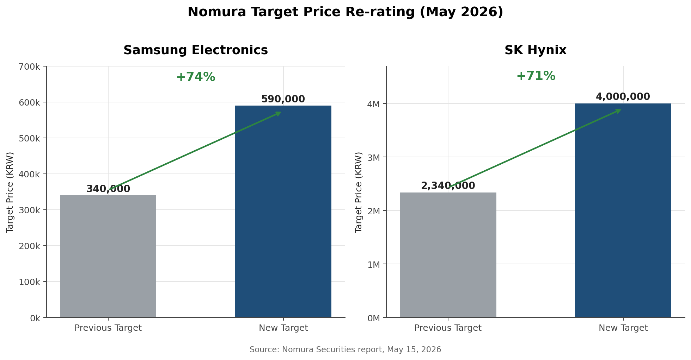
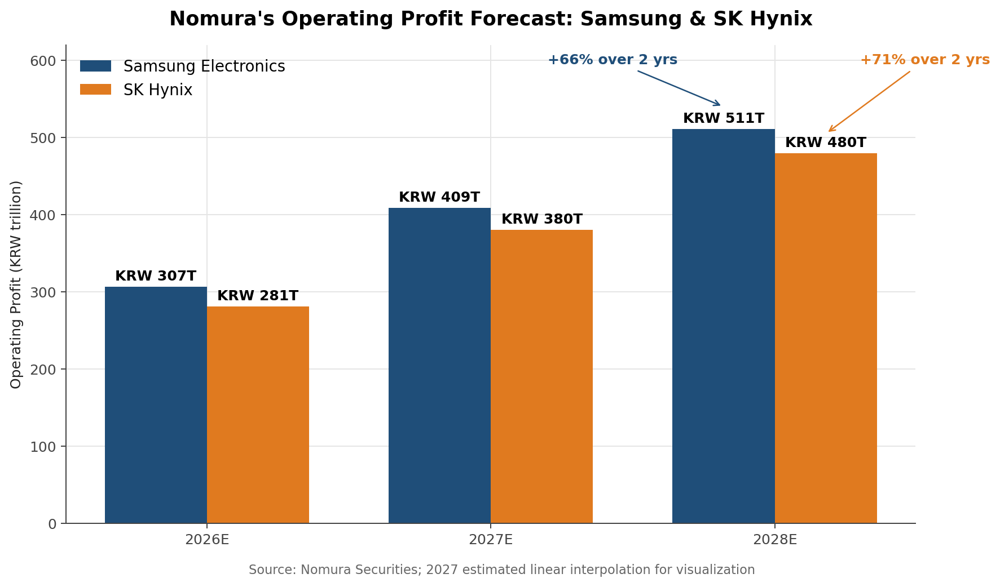
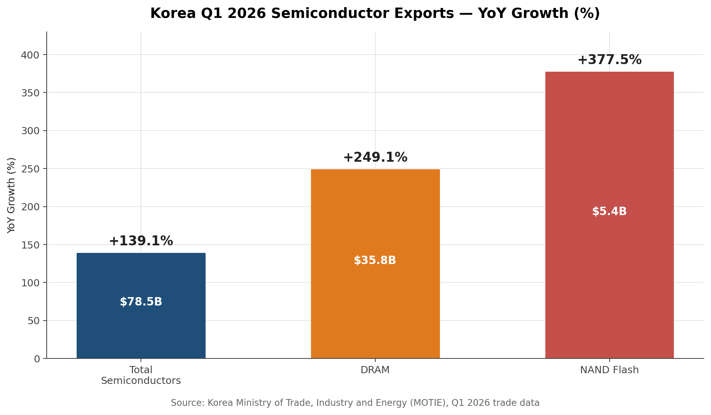
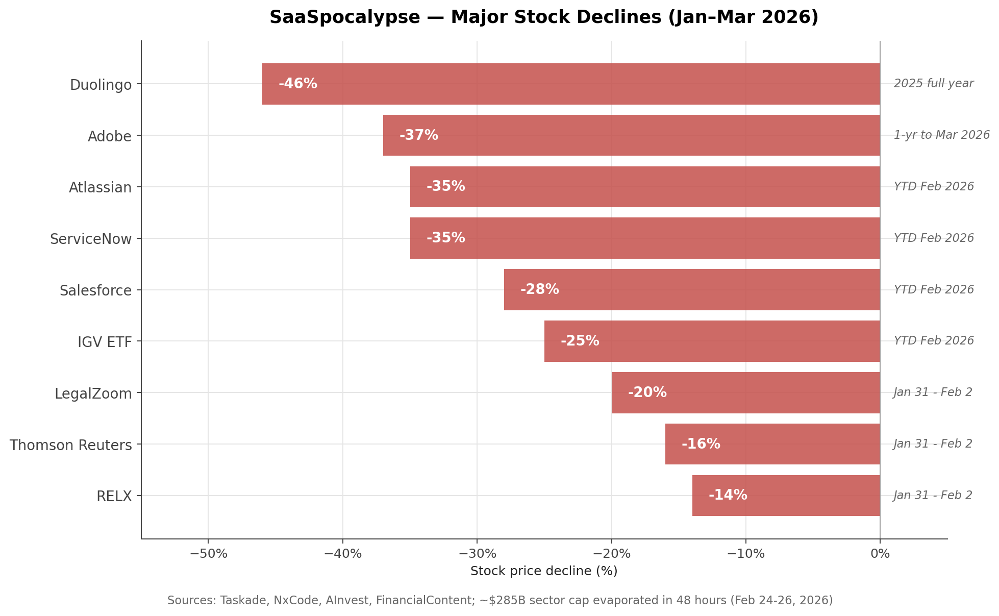
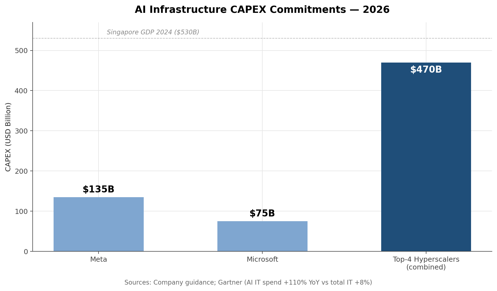
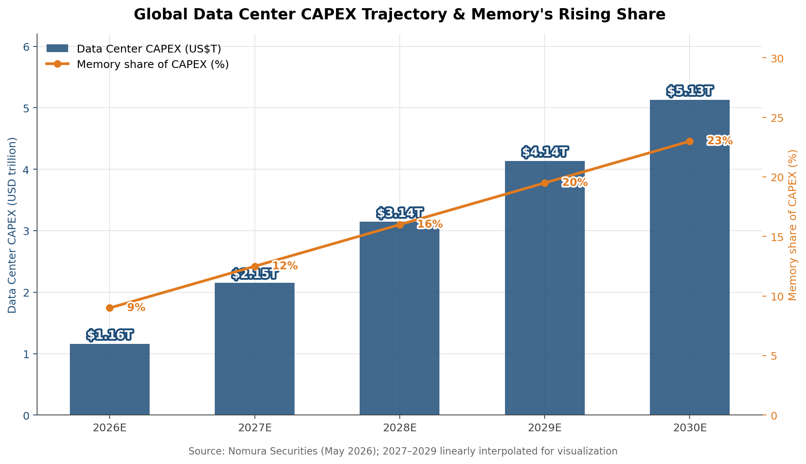

# The AI Memory Supercycle vs. the SaaSpocalypse
## What Nomura's PER Re-rating Really Means — The Market Map Beyond Black Monday

*May 18, 2026 · Dennis Kim*

---

## Introduction

The market is now standing at the intersection of two violently opposing forces: **high rates and geopolitical crisis** on one side, **AI-driven structural growth** on the other. In a single week, the U.S. 30-year Treasury yield hit a 19-year high of 5.127%, Nomura issued the highest-ever target prices for Samsung Electronics and SK Hynix, and the software sector lost approximately $285 billion in just 48 hours. These three events are not separate news items — they are different facets of one massive capital flow.

This column analyzes the inflection point through four lenses: ① Nomura's PER re-rating, ② Japan's U.S. Treasury selling and the global yield surge, ③ the SaaS collapse triggered by AI agents, and ④ the capital flow being recycled back into Korean semiconductors.

---

## 1. Nomura's PER Re-rating — What It Really Means

On May 15, 2026 (local time), Nomura Securities raised Samsung Electronics' target price from KRW 340,000 to **KRW 590,000**, and SK Hynix's from KRW 2.34 million to **KRW 4.0 million**. Both imply ~118–120% upside from current levels, and SK Hynix's KRW 4M target is the highest ever issued by any sell-side firm.[¹][²]

### From PBR to PER — A Fundamental Shift in Valuation Methodology

Memory has historically been classified as a **cyclical** industry — wild swings between profit and loss — so analysts defaulted to **PBR (price-to-book)** since PER (price-to-earnings) assumes durable earnings.[⁴] Nomura now argues that AI data center investment has transformed memory into a **structural long-term growth industry**.

> **Nomura's core thesis:** Samsung and SK Hynix trade at ~6x 12-month forward PER, vs. TSMC at ~20x. Their risk premium should converge toward TSMC's level.[⁵]

### Earnings Outlook — Operating Profit +66–71% over Two Years

Nomura forecasts Samsung's operating profit to rise from KRW 307 trillion in 2026 to **KRW 511 trillion in 2028**, and SK Hynix's from KRW 281 trillion to **KRW 480 trillion** over the same period.[⁶] The recovery in Samsung's foundry profitability, however, is still considered limited.

### The HBM ASP Explosion

The most striking figure is on unit pricing. Nomura projects **SK Hynix's HBM average selling price (ASP) per gigabyte to jump from $12.90 in 2026 to $20.90 in 2027** — a 62% rise in a single year.[⁷] This isn't just volume growth; it is a structural **re-pricing** of the product itself.

### Persistent HBM Shortage and the "Wafer Cannibalization" Effect

- **2026 sold out:** SK Hynix's CFO confirmed that its entire 2026 HBM supply has been sold out; Micron similarly stated its 2025 and 2026 HBM capacity is fully booked.[⁸]
- **NVIDIA cutting RTX 50 production by 30–40%:** With memory makers prioritizing AI data-center allocations, NVIDIA plans to reduce H1 2026 RTX 50-series GPU production by 30–40%.[⁹]
- **3x wafer consumption:** HBM consumes roughly 3x the wafer capacity of standard DDR5 per equivalent output, creating additional supply constraints on commodity DRAM produced in the same fab footprint.

### HBM4 and the 16-Hi Stacking Bottleneck

Samsung, SK Hynix, and Micron are all developing **16-Hi HBM** that NVIDIA has requested for delivery in H2 2026. The wafer thickness must shrink from the current 12-Hi standard of ~50μm down to ~30μm — a challenge industry observers describe as "formidable."[¹⁰] This adds powerful technical support to Nomura's "structural supply shortage" narrative.

### Stargate — The Black-Hole Demand

The single strongest pillar under Nomura's bull case is the **OpenAI Stargate contract**. The October 2025 agreement projects OpenAI's eventual demand at **900,000 DRAM wafers per month** — roughly **40% of current global DRAM output**, and more than double current global HBM capacity. The deal represents over **KRW 100 trillion ($72B) in incremental demand for Korean chipmakers over four years**.[¹¹]

### Korean Semiconductors — Trade Data Already Confirms the Supercycle

Trade data already shows the supercycle in motion. **Q1 2026 Korean semiconductor exports hit $78.5B (+139.1% YoY), with DRAM +249.1% and NAND +377.5%.**[³]

---

## 2. Japan's Treasury Selling and the Global Yield Spike

In the same week, the bond market is undergoing an equally disruptive event in the opposite direction.

### The "Japan Anchor" Cracks

On January 20, 2026, the **Japanese 40-year JGB yield rocketed to 4.24%, breaching the 4% threshold for the first time in over three decades**.[¹²] Japanese life insurers like Dai-ichi and Nippon Life are sitting on roughly ¥9 trillion ($60B) in unrealized losses on their domestic bond portfolios, accelerating their capital repatriation as they liquidate U.S. and European debt to reinvest at the now-attractive 4% domestic yields.[¹³]

### Japan's U.S. Treasury Selling — Largest in Four Years

In Q1 2026, Japan's net selling of U.S. government, agency, and municipal bonds totaled **¥4.67 trillion (~KRW 44.1 trillion)** — the largest quarterly sell-off since Q2 2022. Japan still holds about **$1.2 trillion (12.4% of all foreign-held U.S. debt)**, making it the largest foreign holder.[¹⁴]

### 30-Year U.S. Treasury at 5.127% — Highest Since 2007

- **May 15, 2026:** U.S. 30-year Treasury yield surged to 5.121%, the highest level since 2007.[¹⁵]
- **Iran-war inflation:** Per the U.S. Treasury TBAC report, oil prices are up ~60% since the start of the Iran conflict and ~80% since the start of 2026. 1-year inflation swaps have risen +100bp in Europe and +75bp in the U.S.[¹⁶]
- **April CPI 3.8%:** Highest since May 2023.
- **Fed hike probability:** Traders' implied probability of a Fed rate hike by December surged from 14% to **48%**, while the probability of a cut dropped below 1%.[¹⁷]

### Global Synchronization

UK 10-year gilts hit their highest level since 2008; 30-year gilts hit their highest since 1998; German bunds reached levels not seen since 2011.[¹⁵] This is not a Japan-specific problem — it is a **global term premium repricing**.

---

## 3. AI's Destruction of Software — "SaaSpocalypse"

In February 2026, a single demo by an AI agent vaporized approximately **$285 billion** of SaaS market cap in just 48 hours.

### Timeline of the Event

- **January 31:** Anthropic released Claude Cowork plugins (legal workflow automation, contract review, NDA triage, compliance checking). Within 48 hours, LegalZoom fell 20%, Thomson Reuters fell 16%, RELX fell 14%.[¹⁸]
- **February 24:** Anthropic officially launched Claude Cowork. The demo showed an AI agent autonomously completing multi-step legal, financial, customer support, and project management workflows.[¹⁹]
- **February 24–26 (48 hours):** Approximately $285 billion in market cap evaporated. Jefferies' Jeffrey Favuzza coined the term "SaaSpocalypse."[²⁰]
- **March 12:** Adobe's Shantanu Narayen announced his resignation as CEO after 18 years.[²¹]

### Individual Stock Damage

| Stock | Decline | Period |
|---|---:|---|
| Duolingo | -46% | Full year 2025 |
| Adobe | -37% | 1-year through Mar 2026 |
| Atlassian | -35% | YTD Feb 2026 |
| ServiceNow | -35% | YTD Feb 2026 |
| Salesforce | -28% | YTD Feb 2026 |
| IGV ETF | -25% | YTD Feb 2026 (worst since 2008) |

Adobe's forward PER has compressed to **11.5x** from its historical 30x average, while Apple has launched its **$12.99/month** Creator Studio bundle in direct assault on Adobe's $69.99/month Creative Cloud.[²¹]

### Structural Driver — Not a One-Off Panic, But a "Budget Migration"

**AI CAPEX is cannibalizing SaaS budgets:**
- Meta 2026 AI CAPEX: **$135B**, Microsoft annual: **$75B**
- Top-4 hyperscalers combined: **$470B+** (approaching Singapore's $530B GDP)
- Gartner: Enterprise AI IT spending up **+110% YoY**, while total IT budgets up just 8%[¹⁹]
- BetterCloud 2025: Average SaaS apps per company **down 18%**; 82% of companies actively reducing supplier counts[¹⁹]

Valuations have re-set accordingly. The median forward PER for 157 public SaaS firms compressed from **39x to 21x**; the median SaaS revenue multiple is now 4.0x — the lowest since 2016.

### The Counter-Narrative — "SaaS Isn't Dead, the Model Is Changing"

There's a strong opposing camp arguing this is fear-driven overshoot. ServiceNow's Now Assist has reached **$600M ACV**; Salesforce's Agentforce + Data Cloud have reached **$1.4B ARR**.[²²] NVIDIA's Jensen Huang flatly rejected the thesis: "The notion that AI is going to replace software companies is the most illogical thing in the world." Gartner forecasts that **35% of point-product SaaS will be replaced by AI agents by 2030** — meaning 65% will survive, albeit in evolved form.[²³]

The real story isn't the death of SaaS — it is **the flattening of the middle layer**. Value is flowing to both extremes: ① downstream **compute/memory (semiconductors)**, ② upstream **data/defense moats (proprietary data, regulated industries)**.

---

## 4. Korean Semiconductors — The Paradoxical Beneficiaries of the SaaSpocalypse

### Data Center CAPEX — 5x Surge

Nomura forecasts global data center CAPEX to surge from **$1.16 trillion in 2026 to $5.13 trillion in 2030 — roughly a 5x increase**. Memory's share of that CAPEX is projected to expand from **9% today to 23% by 2030**.[¹⁷]

### AI Inference and Agentic AI Are Detonating Memory Demand

Nomura emphasizes that as AI shifts from "Training" toward "Inference" and "Agentic AI," **KV (Key-Value) cache memory demand is increasing exponentially.**

> Simple Q&A: ~30 output tokens  
> 1-hour video generation: ~100 million output tokens

With the spread of agentic AI, per-user token consumption rises exponentially. Memory bandwidth and capacity are no longer optional — they are foundational.

### Uber — The "Physical Data" and "Gateway Consolidation" Survival Strategy

Even inside the SaaSpocalypse, companies like Uber are building moats with **physical road-level data and large-scale driver networks that AI cannot easily replace**. Through partnerships with Expedia and others, Uber controls the entire booking-to-payment **transaction gateway** within its app. In June 2025, Uber launched **Uber AI Solutions** to monetize its physical business process data by selling it to external enterprises and AI labs.[²⁴]

### The SaaSpocalypse Paradox — "The AI Eating Software Ultimately Feeds Semiconductors"

The AI destroying software directly drives demand for the **more powerful AI infrastructure (semiconductors)** required to run it. As AI evolves from a passive tool into an autonomous "agent," the memory bandwidth and capacity required scale exponentially. In the SaaSpocalypse, the capital that fled the "middle-layer software" is **recycled back into the downstream compute/memory layer** — and the direct beneficiaries are the Korean memory duopoly that dominates HBM and high-capacity DRAM.

---

## Conclusion

The bond-market panic of Black Monday and the explosive demand of the AI supercycle are two sides of the same coin. **High rates are dismantling the SaaS seat-based pricing model; AI is taking its place; and only the memory required to run that AI is in structural shortage.** Nomura's PER re-rating isn't merely a bullish call — it's an attempt to price in the terminal destination of this capital flow.

---

## 📎 References

1. Edaily, "Nomura: 'Samsung KRW 590k, SK Hynix KRW 4M'", May 17, 2026. https://www.edaily.co.kr/News/Read?newsId=02627286645449904
2. Money Today, "Nomura Sharply Raises Samsung & SK Hynix Targets", May 17, 2026. https://www.mt.co.kr/stock/2026/05/17/2026051710145956679
3. Segye, "Samsung KRW 590k & SK Hynix KRW 4M — Nomura's Re-rated 'AI Semi Value'" (incl. Q1 export data), May 17, 2026. https://www.segye.com/newsView/20260517501403
4. Hankyung, "Black Monday Looms, Yet SK Hynix Could Hit KRW 4M", May 17, 2026. https://www.hankyung.com/article/2026051717706
5. The Fact, "Nomura's Record-High Target Prices for Samsung & SK Hynix", May 17, 2026. https://news.tf.co.kr/read/economy/2323451.htm
6. Insight, "Samsung KRW 590k, SK Hynix KRW 4M — Nomura's Bold Call", May 17, 2026. https://www.insight.co.kr/news/554450
7. Daum/Hankyung (HBM ASP $12.90→$20.90), May 18, 2026. https://v.daum.net/v/20260518052054810
8. Introl, "South Korea's HBM4 Moment: Stargate Memory Supercycle 2026", Jan 2026. https://introl.com/blog/south-korea-hbm4-stargate-memory-supercycle-2026
9. Introl, "The AI Memory Supercycle: HBM 2026", Jan 3, 2026. https://introl.com/blog/ai-memory-supercycle-hbm-2026
10. TweakTown, "SK hynix, Samsung, and Micron Fighting for NVIDIA 16-Hi HBM4 Orders", Dec 28, 2025. https://www.tweaktown.com/news/109495/
11. Blocks & Files, "High-bandwidth Memory v4 Supply Takes Shape", Jan 28, 2026. https://blocksandfiles.com/2026/01/28/hbm-v4-supply/
12. CNBC, "Japan 40-Year JGB Yield Hits Record 4.24%", Jan 20, 2026. https://www.cnbc.com/2026/01/20/japan-40-year-jgb-government-bond-yield-record-fiscal-jitters-snap-election-call-takaichi.html
13. FinancialContent, "Japan's Bond Market Rebellion", Jan 22, 2026.
14. CNBC, "Japanese Bond Yield Rise Could Shake Up US Borrowing Costs", Feb 20, 2026. https://www.cnbc.com/2026/02/20/japan-bond-yield-us10y-us-treasury-gilts-bunds-takaichi-trade.html
15. NBC News, "Global Markets Sell-Off as Treasury Yields Hit 2007 Highs", May 16, 2026. https://www.nbcnews.com/business/markets/bonds-oil-prices-stocks-trump-china-trip-rcna345290
16. U.S. Treasury TBAC Report, May 2026. https://home.treasury.gov/news/press-releases/sb0490
17. CNBC, "30-Year Treasury Yield Tops 5.1%", May 15, 2026. https://www.cnbc.com/2026/05/15/treasury-yields-surge-as-inflation-data-points-to-tricky-rates-path.html
18. Medium (Jamie Dejter), "The SaaS Apocalypse", Feb 8, 2026. https://medium.com/@jdejter/the-saas-apocalypse-43a2f3ffed2a
19. Taskade, "The SaaSpocalypse: $285B Wiped, AI Agents Rising (2026)", Mar 24, 2026. https://www.taskade.com/blog/saaspocalypse-explained
20. NxCode, "SaaSpocalypse 2026: Why AI Just Wiped $285B from Software Stocks", Feb 5, 2026. https://www.nxcode.io/resources/news/saaspocalypse-2026-software-stock-crash
21. FinancialContent, "Adobe Deep-Dive: Navigating the CEO Transition and the AI 'SaaSpocalypse'", Mar 16, 2026. https://www.financialcontent.com/article/finterra-2026-3-16-adobe-adbe-deep-dive-navigating-the-ceo-transition-and-the-ai-saaspocalypse
22. Yahoo Finance SG, "The SaaS Apocalypse: When Fear Does the Thinking", Feb 20, 2026. https://sg.finance.yahoo.com/news/saas-apocalypse-fear-does-thinking-093000995.html
23. Intellectia, "Will AI Disrupt SaaS Business Model? 2026 Analysis", Feb 25, 2026. https://intellectia.ai/blog/will-ai-disrupt-saas-business-model-2026
24. Uber, "Uber Expands AI Data Platform to Power Next-Gen Enterprise and AI Lab Needs", Jun 20, 2025. https://investor.uber.com/newsroom/uber-expands-ai-data-platform/

---

*© 2026 Dennis Kim / Web3Paper. All rights reserved.*
