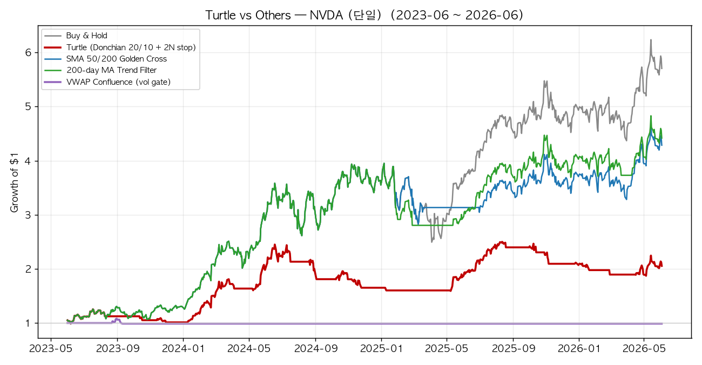
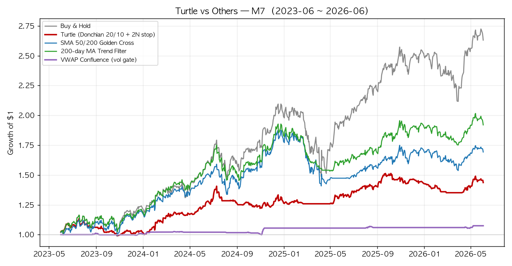
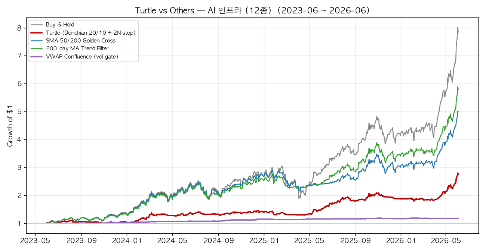

# 터틀 트레이딩(Turtle Trading) — 3년 백테스트로 검증하는 추세추종

> 1983년 리처드 데니스의 "트레이더는 길러진다"는 내기에서 시작된 **추세추종(trend-following)의 원형**.
> 이 전략을 **엔비디아 · M7 · AI 인프라 12종**에 3년간(2023-06 ~ 2026-06) 적용하고,
> **바이앤홀드 · SMA 골든크로스 · 200일선 추세필터 · VWAP 컨플루언스(거래량 게이트)**와
> 매수·매도 타이밍 및 성과를 비교한다.


---

## 1. 터틀 트레이딩이란

전설적 트레이더 **리처드 데니스**(Richard Dennis)는 동료 **윌리엄 에크하르트**와 "트레이더는 타고나는가, 길러지는가"를 두고 내기를 했다. 데니스는 신문 광고로 모은 초보자들에게 단 2주간 규칙만 가르치고 실제 자금을 맡겼고, 이들을 싱가포르 거북이 양식장에 빗대 **"터틀"**(turtles)이라 불렀다. 터틀들은 1980년대에 **연평균 80%대** 수익을 내며, "감(感)이 아니라 규칙으로 추세를 따른다"는 추세추종의 신화가 됐다.

핵심 철학은 단순하다.

> **"손실은 짧게, 이익은 길게(cut losses short, let profits run)."**
> 작은 손절을 여러 번 감수하더라도, 몇 번의 큰 추세에 끝까지 올라타 전체 수익을 만든다.

이 README는 그 규칙을 코드로 구현해 **오늘의 AI 주도주**에 적용하면 어떤 결과가 나오는지를 정직하게 측정한다.

---

## 2. Universe (대상 종목)

| 그룹 | 종목 | 설명 |
|---|---|---|
| **NVDA (단일)** | NVDA | AI 사이클의 핵심 단일 종목 |
| **M7** | AAPL · MSFT · GOOGL · AMZN · META · NVDA · TSLA | 매그니피센트 7 |
| **AI 인프라 (12종)** | NVDA · AMD · AVGO · MRVL · TSM · MU · ANET · VRT · SMCI · PLTR · DELL · ORCL | AI 데이터센터 밸류체인 |

> AI 인프라 유니버스는 [AMQS-AI-Infra](https://github.com/gameworkerkim/vibe-investing/tree/main/01.Trading%20Strategy/Adaptive%20Momentum%20Quant%20Strategy%20(AMQS)%20for%20AI%20Infra)의 universe를 계승해 구성했다.

---

## 3. 비교 전략 5종

| 전략 | 진입 신호 | 청산 신호 | 리스크 관리 | 성격 |
|---|---|---|---|---|
| **Buy & Hold** | 시작일 매수 | 없음 | 없음 | 벤치마크 |
| **🐢 Turtle (System 1)** | 직전 **20일 신고가 돌파** | 직전 **10일 신저가 이탈** | **ATR 2N 손절** | 돌파형 추세추종 |
| **SMA 50/200 골든크로스** | 50일선 > 200일선 | 50일선 < 200일선 (데드크로스) | 추세 이탈 시 현금 | 느린 추세추종 |
| **200일선 추세필터** | 종가 > 200일선 | 종가 < 200일선 | 추세 이탈 시 현금 | 시계열 모멘텀 |
| **VWAP 컨플루언스** | 상승장(EMA200↑) + VWAP −σ **눌림** + **거래량 승인(RVOL≥1.5)** + RSI/MACD 반등 트리거 | ATR 2N · VWAP 이탈 · **+σ 과열 익절** | ATR 손절 + 거래량 게이트 | 거래량 검증 눌림매수 |

**터틀 규칙 상세 (이 백테스트 구현)**
- **N(변동성) = 20일 ATR**. 포지션 진입가 기준 **-2N**을 기계적 손절선으로 고정.
- **System 1**: 20일 돌파 진입 / 10일 이탈 청산. (원본의 55/20 System 2는 옵션)
- 단일 종목은 보유 시 100% / 청산 시 현금(0%)의 **이진 노출**로 바이앤홀드와 공정 비교.
- 바스켓은 12종(또는 7종)을 **각각 독립적으로 동일 규칙 매매 후 동일비중 평균**.

**VWAP 컨플루언스 (일봉 스윙 적응판)** — [VWAP 전략 사양](https://github.com/gameworkerkim/vibe-investing/tree/main/01.Trading%20Strategy/Vwap%20strategy) 계승
- 원전략은 **intraday/단기 스윙용**(장중 세션 리셋 VWAP)이라, 일봉 비교를 위해 **20일 rolling VWAP**으로 적응.
- 핵심 규율 그대로: *"거래량 승인(RVOL≥1.5) 없이는 진입하지 않는다."* VWAP은 기관 체결 벤치마크 → 공정가치.
- 진입 = 상승 레짐 + VWAP −σ 눌림(최근 10봉 내) + **거래량 게이트 통과** + RSI 50 상향/ MACD 음→양 반등.
- 청산 = ATR 2N 손절 / VWAP −0.5σ 결정적 이탈 / VWAP +2.5σ 과열 익절(평균회귀).

> 신호는 당일 종가로 계산하고 **포지션은 다음 날 반영**(룩어헤드 제거). yfinance 분할·배당 조정가·거래량 사용. 무위험수익률 0% 가정. **거래비용은 전 전략 공통 미반영**(상대 비교 목적).

---

## 4. 백테스트 결과 (2023-06 ~ 2026-06, 3년)

### 4-1. NVDA (단일 종목)

| Strategy | Total Return % | CAGR % | Vol % | Sharpe | MaxDD % | Time in Mkt % | Trades | Win % |
|---|---|---|---|---|---|---|---|---|
| Buy & Hold | **470.5** | **79.0** | 46.8 | 1.48 | -36.9 | 100.0 | 1 | 100 |
| 🐢 Turtle (20/10 + 2N stop) | 105.6 | 27.2 | 29.0 | 0.98 | -35.0 | 45.9 | 15 | 33 |
| SMA 50/200 Golden Cross | 328.7 | 62.7 | 43.5 | 1.34 | -28.4 | 91.0 | 2 | 100 |
| 200-day MA Trend Filter | 341.8 | 64.3 | 42.3 | 1.39 | -29.0 | 91.0 | 5 | 60 |
| 🟣 VWAP Confluence (vol gate) | -1.1 | -0.4 | **4.3** | -0.06 | **-8.5** | **1.7** | 1 | 0 |



> NVDA는 추세가 너무 강해 **VWAP −σ 눌림 + 거래량 + 반등 트리거**가 거의 정렬되지 않는다 → 3년간 단 1회 진입(시장 노출 1.7%). 컨플루언스 전략의 극단적 고선택성을 보여준다.

### 4-2. M7 (매그니피센트 7, 동일비중)

| Strategy | Total Return % | CAGR % | Vol % | Sharpe | MaxDD % | Time in Mkt % | Trades | Win % |
|---|---|---|---|---|---|---|---|---|
| Buy & Hold | **163.0** | **38.2** | 25.7 | 1.39 | -29.0 | 100.0 | 1 | 100 |
| 🐢 Turtle (20/10 + 2N stop) | 43.7 | 12.9 | 12.4 | 1.04 | -13.2 | 84.6 | 8 | 62 |
| SMA 50/200 Golden Cross | 69.3 | 19.2 | 21.0 | 0.94 | -24.9 | 96.9 | 2 | 100 |
| 200-day MA Trend Filter | 92.0 | 24.4 | 19.5 | 1.22 | -20.5 | 97.7 | 4 | 50 |
| 🟣 VWAP Confluence (vol gate) | 7.5 | 2.4 | **2.2** | 1.09 | **-2.6** | **14.9** | 8 | 50 |



### 4-3. AI 인프라 (12종, 동일비중)

| Strategy | Total Return % | CAGR % | Vol % | Sharpe | MaxDD % | Time in Mkt % | Trades | Win % |
|---|---|---|---|---|---|---|---|---|
| Buy & Hold | **684.7** | **99.1** | 39.7 | 1.94 | -38.0 | 100.0 | 1 | 100 |
| 🐢 Turtle (20/10 + 2N stop) | 174.1 | 40.1 | 20.0 | 1.78 | -14.1 | 90.7 | 10 | 60 |
| SMA 50/200 Golden Cross | 399.1 | 71.1 | 31.7 | 1.85 | -25.7 | 100.0 | 1 | 100 |
| 200-day MA Trend Filter | 479.2 | 79.9 | 30.1 | **2.10** | -22.4 | 100.0 | 1 | 100 |
| 🟣 VWAP Confluence (vol gate) | 17.2 | 5.4 | **3.3** | 1.62 | **-2.2** | **35.7** | 19 | 58 |



> 굵게 = 각 지표의 최우수/최저(낙폭·변동성). 표·차트는 `script/turtle_backtest.py` 실행 시 자동 생성.

---

## 5. 결과 해석 - 무엇을 말하는가?

이번 백테스트 구간(2023~2026)은 **AI가 이끈 역사적 강세장**이었다. 이 환경에서 결과는 추세추종의 본질을 정직하게 드러낸다.

1. **강세장에서는 바이앤홀드가 수익률의 왕이다.** 끊김 없이 100% 노출된 바이앤홀드가 모든 그룹에서 절대수익 1위였다(NVDA +473%, AI인프라 +689%). 추세가 한 방향으로 강할 때, '시장에서 빠져 있는 시간'은 그 자체가 비용이다.

2. **터틀의 약점은 '휘프소(whipsaw)'와 '낮은 시장 노출'이다.** 터틀은 NVDA에서 시장에 머문 시간이 **46%**에 불과했고, 거래 15번 중 **승률 33%**였다 — 잦은 돌파 실패로 현금화되며 큰 상승의 상당 부분을 놓쳤다. 절대수익은 바이앤홀드의 1/4 수준(+106%).

3. **그러나 터틀의 진짜 가치는 '낙폭 방어'에 있다.** AI 인프라 바스켓에서 터틀의 최대낙폭(MDD)은 **-14.1%**로 바이앤홀드(-38.0%)의 절반 이하였고, M7에서도 -13.2% vs -29.0%였다. **변동성(Vol)도 전 그룹 최저.** 즉 터틀은 "덜 벌지만 훨씬 덜 다친다."

4. **고전적 추세추종(SMA·200일선)이 강세장에서는 가장 균형적이었다.** 200일선 필터는 시장에 90~100% 머물며 상승을 대부분 누리되, 큰 추세 전환에서 빠져 낙폭을 줄였다 — AI인프라에서 **샤프 2.10**으로 바이앤홀드(1.94)보다 위험조정수익이 우수했다.

5. **VWAP 컨플루언스는 "저격수"다 — 거의 쏘지 않는다.** 거래량 승인까지 요구하는 고선택성 탓에 시장 노출이 **1.7%(NVDA)~35.7%(AI인프라)**에 불과했다. 그 결과 강세장 절대수익은 +7~17%로 미미했지만, **최대낙폭이 −2~−9%로 압도적으로 작았고**(거래당 자본 보존), AI인프라 샤프 1.62로 '쏜 거래'의 질은 나쁘지 않았다. 이는 VWAP 사양서 스스로 밝힌 단점 — *"낮은 매매 빈도 · intraday VWAP의 시간 종속(스윙 부적합)"* — 이 데이터로 그대로 입증된 것이다. **일봉 스윙에선 시장의 큰 추세를 거의 놓친다.**

> **핵심 통찰:** 터틀(돌파형)과 VWAP(눌림 검증형)은 모두 변동성이 큰 **횡보·하락장에서 자본을 지키는** 설계다.
> 한 방향으로 매끄럽게 오르는 강세장에서는 — 터틀은 잦은 돌파 실패로, VWAP은 과도한 선택성(거래량 게이트)으로 — 오히려 발목이 잡힌다.
> **요구 조건이 많을수록 시장 참여가 줄고(B&H 100% → 터틀 46~91% → VWAP 2~36%), 강세장 수익은 그만큼 양보된다.**
> 3년 표본은 강세장 일색이므로, 이 결과는 "이 전략들이 나쁘다"가 아니라 **"다른 날씨를 위한 우산"임을 보여준다.**

---

## 6. 기법별 장단점 (장담점 비교)

### 🐢 Turtle Trading
| 장점 | 단점 |
|---|---|
| 손절·사이징이 규칙으로 고정 → **감정 개입 최소** | 강세장에서 잦은 휘프소·현금화로 **수익 기회 상실** |
| ATR 2N 손절로 **최대낙폭·변동성 최저** | **승률 낮음(33~62%)** — 심리적으로 견디기 어려움 |
| 변동성 역가중 사이징으로 **종목 간 리스크 균등화** | 1980년대 다(多)시장 선물용 → 단일 주식엔 표본·신호 부족 |
| 횡보·급락장에서 **자본 보존** 탁월 | 1일 신호 지연·거래비용 미반영 시 실거래 괴리 |

### Buy & Hold
| 장점 | 단점 |
|---|---|
| **강세장 절대수익 최강**, 비용·세금 최소 | **낙폭 무방비**(-37~-38%) — 약세장 직격 |
| 운용 노력 0, 복리 효과 극대 | 종목 선택 실패 시 회복 불가(생존편향 유의) |

### SMA 50/200 골든크로스
| 장점 | 단점 |
|---|---|
| 단순·견고, **큰 추세 전환을 대체로 포착** | 신호가 느려 **고점·저점에서 지각**(데드크로스 지연) |
| 거래 빈도 낮아 비용·휘프소 적음 | 급반등장에서 재진입 늦음(NVDA 2025 구간 참조) |

### 200일선 추세필터 (시계열 모멘텀)
| 장점 | 단점 |
|---|---|
| 가장 단순한데 **위험조정수익(샤프) 최우수** 구간 多 | 200일선 부근 횡보 시 잦은 진입·청산 가능 |
| 강세장 노출 유지 + 추세 붕괴 시 회피 | 단일 임계값 의존 → 변동성 큰 종목에선 후행 |

### 🟣 VWAP 컨플루언스 (거래량 게이트)
| 장점 | 단점 |
|---|---|
| **거래량 승인**으로 가짜 돌파 필터 → 신호 품질↑ | **매매 빈도 극단적으로 낮음**(노출 2~36%) → 강세장 큰 추세를 거의 놓침 |
| 거래당 **최대낙폭 최저(−2~−9%)** · 변동성 최저 | **파라미터 과다**(5개 지표) → 과최적화 위험, 표본 적어 통계력 약함 |
| 기관 체결 기준선(VWAP) 부근 진입 → 구조적 이점 | intraday VWAP은 **시간 종속** → 일봉 스윙엔 본질적 부적합(Anchored VWAP 필요) |
| ATR 손절 + 평균회귀 익절로 **체계적 리스크 통제** | NVDA처럼 강하게 추세 나는 종목엔 거의 신호 없음(3년 1회) |

> VWAP 컨플루언스의 장단점 원문: [VWAP 전략 해설](https://github.com/gameworkerkim/vibe-investing/blob/main/01.Trading%20Strategy/Vwap%20strategy/readme.md) · [사양서](https://github.com/gameworkerkim/vibe-investing/blob/main/01.Trading%20Strategy/Vwap%20strategy/vwap_strategy_spec_KR_EN.md)

---

## 7. 결론 — 추격 vs 추세, 무엇을 택할까

- "강세장에 한 종목을 길게 들고 갈 자신"이 있다면 바이앤홀드가 가장 많이 번다. 단, -38% 낙폭을 버틸 수 있어야 한다.
- "낙폭과 변동성을 줄이고 밤에 발 뻗고 자고 싶다"면 터틀의 규칙 기반 손절이 답이다. 수익은 양보하되 자본을 지킨다.
- "둘의 절충"을 원한다면 **200일선 추세필터/SMA 골든크로스**가 강세장 노출과 추세 방어를 균형 있게 가져간다 — 이번 표본에선 가장 실용적이었다.
- "매수 타이밍을 거래량으로 정밀 검증"하고 싶다면 VWAP 컨플루언스가 거래당 낙폭을 최소화한다. 단, 일봉 스윙에선 신호가 너무 드물어 **장기 추세 포착용이 아니라 intraday/단기 정밀 진입 도구**로 봐야 한다.

> 결국 정답은 시장 국면과 투자자의 **낙폭 인내도**에 달려 있다.
> 교훈은 수익률 1등이 아니라 "규칙을 지키면 시장이 어떤 날씨든 살아남는다"는 것이다.
> 그리고 **요구 조건(필터)이 많아질수록 신호 품질은 오르지만 시장 참여와 강세장 수익은 줄어든다** — 이 트레이드오프를 어디서 끊을지가 전략 선택의 본질이다.

---

## 8. 재현 방법

```bash
pip install -r requirements.txt
python script/turtle_backtest.py
```

생성물:
- `data/backtest_results.csv` — 전 그룹·전 전략 성과지표
- `data/results_markdown.md` — README 임베드용 표
- `data/prices_close.csv` — 원본 조정 종가
- `charts/equity_*.png` — 그룹별 자산곡선 비교 차트

---

## 면책

본 백테스트는 **교육·연구 목적의 참고자료**다. (1) 거래비용·세금·슬리피지 미반영, (2) 표본 구간이 **강세장에 편향**되어 약세장 성과는 알 수 없음, (3) 생존편향(현재 시점 우량주 선택)이 존재, (4) 과거 성과는 미래를 보장하지 않는다, (5) **VWAP 컨플루언스는 본래 intraday/단기 스윙 전략을 일봉(rolling VWAP)으로 적응한 것**이라 원전략의 성과와 다를 수 있다. 단일 종목·고PER 주식에 레버리지·집중 베팅은 원금 손실 위험이 크다. **투자 판단과 책임은 전적으로 투자자 본인에게 있다.**

---

### 레퍼런스 / 관련 전략
- *Way of the Turtle* — Curtis Faith (터틀 원전)
- Jegadeesh & Titman (1993) — 모멘텀 팩터
- [VWAP 컨플루언스 거래량 매매 전략](https://github.com/gameworkerkim/vibe-investing/tree/main/01.Trading%20Strategy/Vwap%20strategy) (본 레포 — 비교 대상 5번 전략의 원전)
- 본 레포: [AMQS](https://github.com/gameworkerkim/vibe-investing/tree/main/01.Trading%20Strategy/Adaptive%20Momentum%20Quant%20Strategy%20(AMQS)) · [AMQS-M7](https://github.com/gameworkerkim/vibe-investing/tree/main/01.Trading%20Strategy/Adaptive%20Momentum%20Quant%20Strategy%20(AMQS)%20for%20M7) · [AMQS-AI-Infra](https://github.com/gameworkerkim/vibe-investing/tree/main/01.Trading%20Strategy/Adaptive%20Momentum%20Quant%20Strategy%20(AMQS)%20for%20AI%20Infra)
