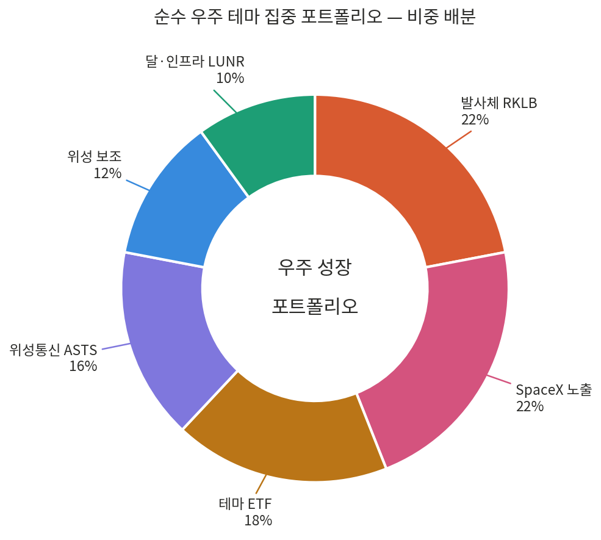

# Elon Musk — 일론 머스크 투자 아이디어 칼럼 & 우주 포트폴리오

> **vibe-investing / 02.Investment Idea Column / Elon Musk**
>
> 일론 머스크(Elon Musk) 생태계 — SpaceX 상장(SPCX), 우주(space) 기업 투자, 그리고 머스크라는 인물의 서사 — 를 다루는 칼럼·전략 모음입니다. SpaceX IPO 심층 분석, 순수 우주 테마 집중 포트폴리오(초고위험), 그리고 머스크의 행동양식을 읽는 인물 칼럼을 한 폴더에 묶었습니다.

**키워드 / Keywords:** SpaceX · SPCX · SpaceX IPO · 스페이스X 상장 · 우주 투자 · 우주 기업 포트폴리오 · space stocks · Rocket Lab (RKLB) · AST SpaceMobile (ASTS) · Intuitive Machines (LUNR) · 차등 의결권 · 궤도 데이터센터 · orbital data center · xAI · Tesla · 머스코노미 · Muskonomy · Elon Musk · 일론 머스크 · vibe investing · AI 투자

---

## 폴더 구성 (Contents)

이 폴더는 세 갈래로 읽힙니다 — **(A) IPO 분석**, **(B) 실행 포트폴리오**, **(C) 인물 서사**.

| 파일 | 유형 | 한 줄 요약 |
|---|---|---|
| [SpaceX IPO.md](./SpaceX%20IPO.md) | 분석 칼럼 | 차등 의결권·우주 AI 데이터센터·테슬라 주주 우려, 세 갈래로 읽는 SPCX 상장 심층 분석 |
| [portfolio.md](./portfolio.md) | 투자 전략 | 순수 우주 테마 집중 포트폴리오(초고위험·고변동), 성장·모멘텀 틸트, 3회 분할 진입 |
| [spacex_portfolio.pdf](./spacex_portfolio.pdf) | 투자 전략 (PDF) | 위 포트폴리오의 색상 코딩 표·차트 포함 워드/PDF 배포본 |
| [allocation_chart.png](./allocation_chart.png) | 차트 이미지 | 우주 성장 포트폴리오 비중 배분 도넛 차트 |
| [musk_beijing_column.md](./musk_beijing_column.md) | 인물 칼럼 | 베이징 국빈만찬에서 드러난 머스크의 '하이퍼 리치' 행동 문법 |
| [llms.txt](./llms.txt) | 메타데이터 | LLM·검색 엔진용 구조화 요약 (포트폴리오 기준) |

---

## A. SpaceX IPO 심층 분석 — [`SpaceX IPO.md`](./SpaceX%20IPO.md)

> *2026년 5월 21일 작성 · 나스닥 티커 SPCX · S-1 공개본 기준*

SpaceX가 2026년 5월 20일 SEC에 S-1을 공개하며 역사상 최대 규모로 거론되는 IPO의 윤곽이 드러났다. 시중에 도는 '기업가치 2조 달러·조달 750억 달러'는 보도된 목표 상단치이며, S-1이 시사하는 평가 수준은 약 1.75조 달러대다. 이 칼럼은 독자가 가장 많이 묻는 세 질문을 정면으로 다룬다.

1. **차등 의결권** — 머스크가 의결권 85.1%를 쥐는 클래스 A/B 구조가 스타십·화성 비전의 '시간 지평'을 시장 압력에서 어떻게 분리하는가. 메타·알파벳 선례와 견제 부재 리스크를 함께 짚는다.
2. **우주 AI 데이터센터** — 2028년 배치 목표의 궤도 데이터센터가 에너지·냉각 병목 해소와 발사·통신·연산의 수직 통합(스타십·스타링크·xAI)으로 마진을 어떻게 바꾸는가. Anthropic과의 월 12.5억 달러 계약이 단초.
3. **테슬라 주주 우려** — 관심 분산('머스크 컨글로머릿 리스크'), 자본 역류, 합병 시 희석, 거버넌스 비대칭이라는 네 가지 구체적 우려.

**핵심 수치:** SPCX · 의결권 85.1% · 평가 ~1.75조 달러 · 연 손실 ~130억 달러(xAI 합병 회계) · 스타링크 매출 비중 ~61%, 가입자 1,000만 돌파

---

## B. 우주 기업 투자 포트폴리오 — [`portfolio.md`](./portfolio.md) · [`spacex_portfolio.pdf`](./spacex_portfolio.pdf)

> *성격: 순수 우주 테마 집중(초고위험·고변동) · 코어 틸트: 성장·모멘텀 · 진입: 3회 분할*

SpaceX 직접 노출(SPCX IPO 청약 + XOVR/DXYZ 우회)을 중심에 두고, 발사체·위성통신·달 인프라까지 묶은 공격적 그로스 포트폴리오. 우선순위는 성장성 → 밸류에이션 안전성 → 현금흐름 → 분산 순.

| 비중 | 종목 | 역할 |
|---:|---|---|
| 22% | RKLB (Rocket Lab) | 발사체 코어 |
| 22% | SPCX + XOVR/DXYZ | SpaceX 노출 (IPO 청약 + 우회) |
| 18% | ARKX + UFO | 테마 ETF (안전판) |
| 16% | ASTS (AST SpaceMobile) | 위성통신 |
| 12% | IRDM + RDW | 위성 보조 (현금흐름) |
| 10% | LUNR (Intuitive Machines) | 달·인프라 |

**진입 전략:** 섹터 단기 과열을 감안해 3회 분할 — ① 지금 40%(ETF·IRDM) → ② SPCX IPO 시점 30%(첫날 추격 금지) → ③ 되돌림 시 30%(RKLB·ASTS·LUNR).

> 주의: 이 포트폴리오는 적자·고밸류 종목이 다수이며, "성장성 최우선"은 곧 "원금 손실 가능성도 최대"를 의미합니다. NVDA 등 AI/반도체와 매크로 동조도가 높아 분산 효과가 제한적입니다.

---

## C. 인물 칼럼 — [`musk_beijing_column.md`](./musk_beijing_column.md)

> *규칙을 만드는 자의 서사 — 베이징 국빈만찬에서 드러난 '하이퍼 리치'의 문법*

2026년 5월 14일 베이징 인민대회당 국빈만찬을, 머스크가 자기 제국의 서사를 송출하는 무대로 활용한 장면을 행동경제학·지위 신호 관점에서 읽는다. 360도 회전 영상(웨이보 5,200만 회), 레이쥔의 셀카 요청('다가오게 만드는 쪽'의 권력), 6세 아들 동행을 통한 후계자 교육이라는 세 장면으로 "규칙 위에 서는 자의 행동양식"을 분석한다. 투자 종목 분석은 아니지만, SpaceX 지배구조 칼럼과 같은 인물 — 견제받지 않는 비저너리 — 을 다른 렌즈로 보는 짝 칼럼이다.

---

## 이 폴더를 읽는 순서 (Reading Path)

- **SpaceX 상장에 투자할지 고민 중이라면** → `SpaceX IPO.md`(왜·리스크) → `portfolio.md`(어떻게·비중)
- **실행 비중·진입 타이밍만 빠르게** → `portfolio.md` 또는 `spacex_portfolio.pdf`
- **머스크라는 인물·지배구조의 본질이 궁금하다면** → `SpaceX IPO.md` 1장(차등 의결권) → `musk_beijing_column.md`

---

## 면책 (Disclaimer)

이 폴더의 모든 문서는 **정보 제공 목적의 시장 논평이며, 특정 증권의 매수·매도를 권유하는 투자 자문이 아닙니다.** 일정·가격·평가액은 보도 및 S-1 공개본 기준으로 최종 공모 조건과 다를 수 있으며, 모든 시세는 작성 시점 기준으로 수시 변동합니다. 투자 판단과 그 결과의 책임은 전적으로 투자자 본인에게 있습니다.

---

상위 폴더: [`02.Investment Idea Column`](../) · 레포 루트: [`vibe-investing`](../../) — *투자를 위한 AI 투자(Vibe Investing) 큐레이션, 시장 분석 칼럼, AI 트레이딩 도구를 다루는 저장소.*
