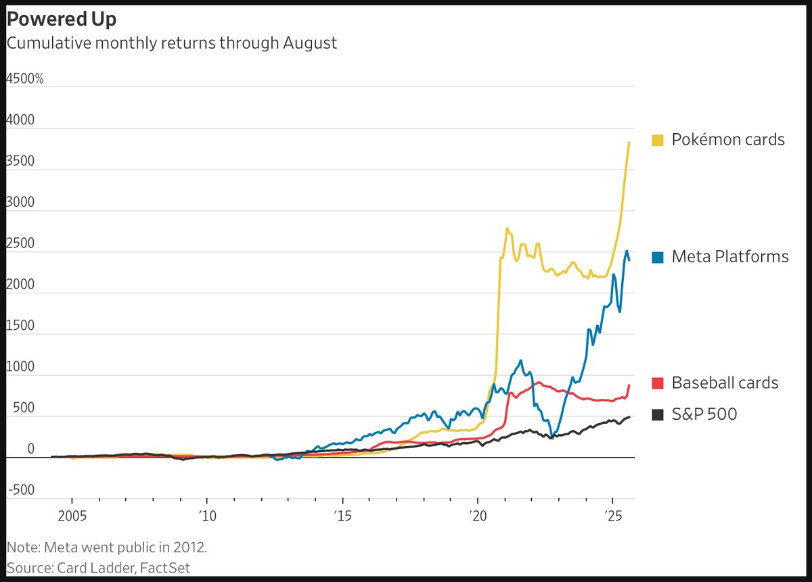

# 소년이 어른이 되면, 키덜트는 어디에 몰입하는가?
### 포켓몬 카드 3,821%와 수집품 자산화의 퀀트 해부 — 미국 스포츠카드 · 일본 포켓몬 · MTG를 중심으로

---

## 들어가며 - 차트 한 장이 말하는 것

WSJ의 "Powered Up" 차트(데이터: Card Ladder, FactSet)는 단순하지만 도발적이다. 2004년부터 2025년 8월까지의 누적 월간 수익률에서 포켓몬 카드는 3,821%를 기록하며 Meta Platforms를 추월했고, Baseball cards와 S&P 500(~483%)을 한참 아래에 남겨두었다. 차트의 노란 선은 2025년 들어 거의 수직으로 꺾여 올라간다.

수직으로 올라가는 선은 두 가지를 동시에 의미한다. 누군가에게는 놓친 수익률이고, 퀀트에게는 parabolic blow-off의 전형적 형태다. 이 칼럼은 후자의 관점에서, "추억"이 자산이 될 수 있는가, 그리고 될 수 있다면 어떤 구조에서 그러한가를 세 개의 수집품 시장 — 미국 스포츠카드, 일본 포켓몬, Magic: The Gathering — 으로 나누어 해부한다.

핵심 명제는 하나다. **수집품은 자산이 아니라 인구통계(demographic)에 대한 베팅이다.** 차트의 3,821%는 cash flow가 아니라, 추억을 가진 소년이 가처분소득을 가진 어른이 되었다는 사실의 가격화다.

---

## 1. 먼저 숫자를 의심하라 — Index Return ≠ Investable Return

퀀트의 첫 번째 규율은 헤드라인 수익률을 액면 그대로 믿지 않는 것이다. 3,821%라는 숫자에는 다음이 빠져 있다.

| 누락 항목 | 실제 영향 |
|---|---|
| **Survivorship bias** | Card Ladder 지수는 살아남아 거래되는 카드의 큐레이션 바스켓이다. 가치를 잃고 거래가 끊긴 수십억 장의 "junk"는 분모에 들어오지 않는다. |
| **Transaction cost** | 옥션 buyer's premium만 15~22%. 매수·매도 왕복이면 수익률의 상당 부분이 마찰비용으로 소멸한다. |
| **Grading cost & risk** | "Near Mint"로 산 카드가 PSA 7~8을 받으면 기대가치가 붕괴된다. 등급 비용 + 대기시간 + 실망스러운 결과는 신규 투자자의 전형적 손실 경로다. |
| **Carry cost** | 보관, 보험, 진위 인증. cash flow가 없는 자산에 **negative carry**가 붙는다. |
| **Mark-to-last-sale** | 지수 NAV는 시가가 아니라 *마지막 체결가*다. 호가 스프레드가 두 자릿수%인 시장에서 청산가능 가치는 NAV보다 한참 낮다. |

즉 net-of-cost IRR은 헤드라인 CAGR보다 구조적으로 훨씬 낮다. 지수는 측정이지 투자가능 수익률이 아니다. 이것이 "LLM은 엑셀이지 오라클이 아니다"라는 명제의 자산 버전이다. **Card Ladder 지수는 엑셀(과거를 계산한 결과)이지, 미래 수익률을 말하는 오라클이 아니다.**

---

## 2. 키덜트 가설 = 인구통계 수요 베팅

수직 상승의 펀더멘털은 명확하다. 1999년 운동장에서 Charizard를 교환하던 소년이 지금 가처분소득을 가진 30 ~ 40대가 되어, 자신의 유년을 다시 사들이고 있다. 전통적 valuation으로는 비합리적인 emotional premium이지만, 놀랍도록 일관적이다. 비-스포츠 카드 지출은 2020 ~ 2025년 사이 **+350%**(Circana). 주식 티커와 달리 PSA 슬랩은 선반에 올려 자랑할 수 있다 — 소비재이자 투자재의 이중성이 demand floor를 만든다.

여기서 퀀트가 던질 질문이 바로 이 칼럼의 제목이다. **소년이 어른이 되면, 키덜트는 다음에 어디로 몰입하는가?**

이 질문은 두 개의 리스크로 분해된다.

- **Cohort aging risk.** 추억 수요는 특정 세대에 묶여 있다. 그 세대가 지출 정점을 지나면 수요는 melting asset이 된다. 1990년대 baseball card "junk wax" 세대가 늙으면서 그 시장이 수십 년간 횡보한 것이 선례다(차트의 빨간 선이 2010년대 후반까지 거의 평평한 이유).
- **Cohort recruitment.** 반대로 신규 세대가 계속 유입되면 demand는 갱신된다. The Pokémon Company의 전략이 정확히 이 지점을 겨눈다 — Pokémon GO(2016), Nintendo Switch, 그리고 **Pokémon TCG Pocket(2025년 2월 매출 $90.4M)**은 디지털 진입로를 통해 신규 cohort를 물리적 카드 수요로 전환시키는 funnel이다. 2026년은 **30주년**으로, 25주년(2021) 당시 특별 발매가 +40~60% 상승했던 전례가 반복 베팅의 근거가 되고 있다.

투자자 관점의 결론: 수집품을 산다는 것은 **"기존 cohort의 지속 + 신규 cohort의 모집"이라는 두 가지 조건부 확률에 long 포지션을 잡는 것**이다. 둘 중 하나라도 깨지면 supply가 고정되어 있어도 가격은 무너진다.

---

## 3. 세 시장의 공급 구조 — 차이는 전부 여기서 갈린다

수집품 투자의 알파는 demand가 아니라 **supply taxonomy**에서 나온다. 세 시장은 표면적으로 같아 보이지만 공급 메커니즘이 근본적으로 다르다.

| 항목 | 일본 포켓몬 (TCG) | 미국 스포츠카드 | Magic: The Gathering |
|---|---|---|---|
| **공급 통제 주체** | 발행사(TPC)가 적극적 재인쇄 | 선수 커리어로 자연 고정 | 발행사(WotC) + Reserved List |
| **신규 공급** | FY25/26 ~100억 장 발행, 누적 850억 장+ | 시즌마다 신규 rookie 발행 | RL은 영구 재인쇄 금지(572장) |
| **희소성의 원천** | *빈티지 고정공급* + 등급 인구(graded pop) | print run + 1/1 패럴렐 | **정책적 영구 hard cap** |
| **고유 리스크** | 재인쇄로 모던 카드 희석 | **선수 단일종목 리스크**(부상·부진·스캔들) | 기능적 재인쇄(functional reprint) 잠식 |
| **유동성 구조** | 그레이딩 카드 7~14일 내 체결, 비교적 높음 | 고가는 사적거래/옥션 중심, 두꺼운 스프레드 | tier1은 유동적, 하위 tier는 OTC급 |
| **퀀트 비유** | 발행사가 공급을 푸는 *연성 통화* | *개별 종목*(idiosyncratic risk 큼) | *fixed-supply 자산*(비트코인 서사에 가장 근접) |

### 3-1. 포켓몬 - 발행사가 공급을 통제하는 "연성 통화"

희소성은 오직 **빈티지 고정공급**(1999 Base Set 등 WOTC 시대)과 **등급 인구**에만 존재한다. 문제는 등급 인구조차 고정이 아니라는 점이다. PSA 그레이딩 물량은 **2020년 약 200만 장 → 2025년 1,900만 장+**, 2026년 들어서도 전년 대비 +39%. PSA 10 개체수가 계속 늘면 "graded scarcity"는 인플레이션을 일으킨다. 즉 포켓몬에서 진짜 fixed supply는 *최상위 빈티지 + 최고 등급* 교집합뿐이며, 그 바깥은 모두 발행사·그레이더가 공급을 풀 수 있는 구간이다.

기록적 단일 체결가 — Base Set 1st Edition Charizard PSA 10 $550K(Heritage, 2025.12), shadowless PSA 10 $954,800(Goldin, 2026.2), 그리고 **Pikachu Illustrator PSA 10 $16.49M(Goldin, 2026.2.16, 기네스 인증 사상 최고가 카드)** — 은 펀더멘털이 아니라 euphoria marker로 읽어야 한다.

### 3-2. 미국 스포츠카드 - idiosyncratic risk가 지배하는 시장

공급은 print 시점에 고정되지만, 가치는 **선수 개인의 단일종목 리스크**에 묶인다. 부상 한 번, 스캔들 한 번에 자산가치가 영구 손상될 수 있다 — 분산 불가능한 리스크다. 고점은 명확히 **2021년**이었고(역대 최고가 25건 중 9건이 2021년 집중), 2022년 조정에서 다수 카드가 고점의 ~ 50%까지 빠졌다가 70 ~ 80% 수준 회복에 그쳤다. 1980~90년대 "junk wax" 과잉발행 붕괴는 *artificial scarcity가 깨지면 어떻게 되는지*에 대한 영구적 교훈이다.

한편 시장의 금융화는 가장 빠르다. PWCC 볼트 AUM $2B+, PWCC Capital의 컬렉션 담보대출 $1억+, Stephen Curry Logoman 1/1을 Alt가 51% 지분 인수해 $5.9M로 평가한 fractional 거래 등. 다만 **fractional 플랫폼은 하락장에서 가장 먼저 얼어붙었다** — 유동성은 fair-weather였다는 뜻이다.

### 3-3. MTG Reserved List -  TCG 유일의 영구 hard cap, 그러나 floor는 아니다

1996년 Chronicles/4th Edition 재인쇄가 컬렉터 카드 가치를 무너뜨린 사건 이후, WotC는 **572장을 영구 재인쇄하지 않겠다**고 선언했다(전부 1999년 6월 이전 인쇄, 추가·삭제 없음). 이것은 TCG 역사상 가장 신뢰할 만한 *영구 공급 상한*이며, fixed-supply 서사 면에서 비트코인에 가장 근접한 수집품 자산이다.

그러나 두 가지가 "reprint-proof = crash-proof"라는 착각을 깬다.

- **2022년 RL은 평균 -30% 하락**(같은 해 S&P 500 -19.4%). 공급이 고정돼 있어도 play-based demand가 식으면 가격은 무너진다. 희소성은 floor를 보장하지 않는다.
- **기능적 잠식.** 2026년 Mark Rosewater는 RL이 *이름만 다른 더 강한 기능적 재인쇄*를 막지는 못한다고 언급했다. Universes Beyond 등으로 functional reprint가 늘면, 명목상 공급은 고정이어도 *효용 기준 공급*은 늘어난다.

RL 내부도 tier로 갈린다: tier1(Power Nine, dual lands)은 risk-averse 보유에 적합하지만, 하위 tier는 buyout에 휘둘리는 OTC급 저유동 종목이다.

---

## 4. "주식과 상관관계가 낮다"는 마케팅의 착시

수집품은 종종 *low-correlation hedge*로 팔린다. 데이터는 정반대를 시사한다.

- 팬데믹 부양책 국면에 포켓몬 +200 ~ 500% 폭등 → 2022 ~ 2023년 -30 ~ 40% 조정.
- 스포츠카드 2022년 고점 대비 ~50%.
- MTG RL 2022년 -30%.

세 시장이 **같은 시점(유동성 위축 국면)에 함께 무너졌다.** 이것은 hedge가 아니라 **liquidity beta가 높은 risk-on 자산**의 행태다. 분산이 가장 필요한 순간(liquidity event)에 주식과 동조해 빠진다 — 상관관계가 *낮은 게 아니라, 평시엔 낮아 보이다가 위기에 1로 수렴*한다. 전형적인 tail-correlation 함정이다.

여기에 cash flow가 없다는 사실이 더해진다. DCF가 정의되지 않으므로 valuation은 순수한 **greater-fool / Keynesian beauty contest**다. 터미널 밸류 = 다음 세대가 이 추억에 지불할 의향. 그 의향이 멈추면 내재가치는 0에 수렴한다.

---

## 5. 버블 신호 체크리스트 (Late-cycle markers)

현재 시장이 점등시키고 있는 신호들을 퀀트 체크리스트로 정리한다.

| 신호 | 현재 상태 | 판정 |
|---|---|---|
| Parabolic terminal acceleration | 포켓몬 지수 2025년 수직 상승 | 🔴 점등 |
| Record single-print euphoria | $16.49M 단일 카드 신기록 | 🔴 점등 |
| Influencer reflexivity | Logan Paul이 $150K Charizard 착용 → 반사적 수요 | 🔴 점등 |
| Retail speculation 진입 | 수집 이력 0인 신규 자금이 sealed를 *금융상품*으로 매수 | 🔴 점등 |
| Grading-pop blow-off | PSA 200만→1,900만 장(5년), 여전히 +39% YoY | 🔴 점등 |
| Crypto-bro crossover | NFT/RWA 하이브리드 TCG로 자금 유입 | 🟠 주의 |
| Counterfeit 급증 | PSA가 위·변조 $200M+ 적발, 온라인 TCG의 15~20%가 위조 추정 | 🔴 점등 (시장 신뢰 훼손) |
| Anniversary 공급 이벤트 | 30주년 = 수요 촉매이자 *신규 공급* 이벤트 | 🟠 양면성 |

대부분이 후기 사이클 마커다. 이것이 곧 "내일 붕괴"를 뜻하진 않는다 — 버블은 fundamentals보다 오래 간다. 다만 risk/reward가 비대칭적으로 나빠지는 구간이라는 신호다.

---

## 6. 퀀트의 결론 — 포지션 사이징의 문제로 환원하라

수집품은 "사야 하나 말아야 하나"의 문제가 아니라 **얼마나, 어떤 전제로 사느냐**의 문제다.

1. **Satellite sleeve로 한정.** 포트폴리오의 core(주식·채권)가 아니라 alternative satellite로, *전액 손실을 견딜 수 있는 크기*로만. cash flow 없는 tail-correlation 자산을 core로 삼는 것은 frame 오류다.
2. **Consumption dividend를 수익의 일부로 계상.** 보유 자체의 즐거움(전시·커뮤니티·소장)을 명시적 return 항목으로 넣어라. 이걸 빼고 순수 금융 IRR만 보면 대부분 음(-)이다. 즐거움이 0인 사람에게 이 자산은 negative-carry 투기일 뿐이다.
3. **공급 구조로 종목 선별.** 같은 수집품이라도 베팅 대상이 다르다 — 포켓몬은 *최상위 빈티지 × 최고 등급* 교집합만이 진짜 고정공급, 스포츠카드는 idiosyncratic 단일종목 리스크를 감수하는 베팅, MTG RL tier1만이 영구 hard cap에 가장 근접. 모던 sealed의 "재인쇄 중단 = 희소" 서사는 demand가 식는 순간 가장 먼저 깨진다.
4. **유동성을 NAV가 아니라 청산가로 평가.** 마지막 체결가는 위로다. 실제로 팔 때의 스프레드·수수료·대기시간을 차감한 *liquidatable value*로 장부를 적어라.
5. **지수를 오라클로 착각하지 말 것.** 3,821%는 과거의 계산 결과(엑셀)이지 미래의 약속(오라클)이 아니다. 추억을 가진 소년이 어른이 되어 만든 수요는 실재하지만, 그 어른도 늙는다. 다음 cohort가 들어오지 않으면 모든 hard cap은 melting asset 위의 숫자일 뿐이다.

---

*Source: WSJ "Powered Up"(Card Ladder, FactSet); Card Ladder Pokémon Index; Circana; PSA 2025 Fraud Report; Goldin Auctions; Heritage Auctions; PWCC; MTG Reprint Policy(Wizards of the Coast); Mark Rosewater(Blogatog, 2026). 본 칼럼은 정보 제공 목적이며 투자 자문이 아니다.*
