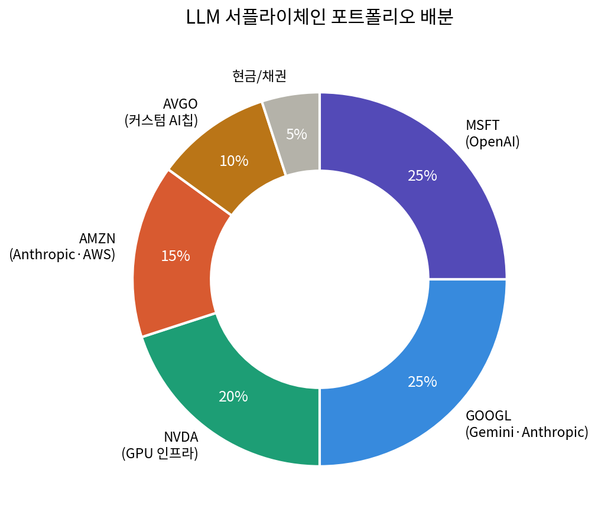
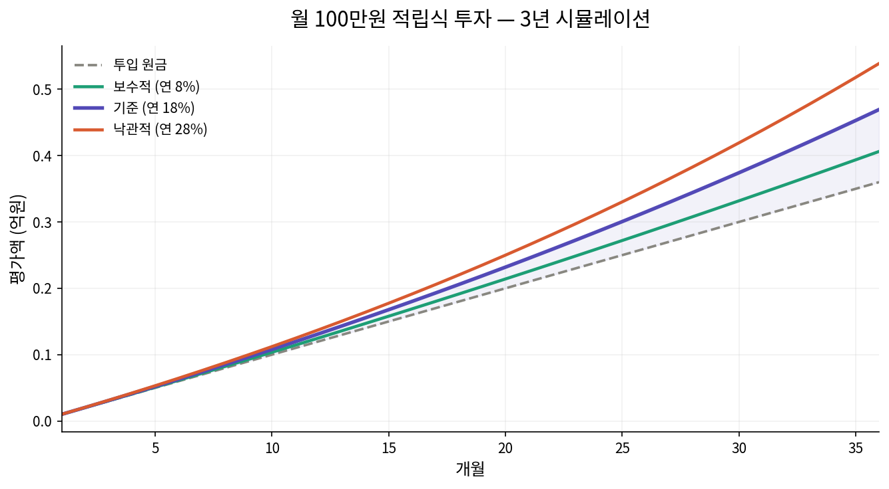

# LLM 서플라이체인 구독수익 모델 투자 포트폴리오

> OpenAI · Google Gemini · Anthropic Claude 성장에 기반한 간접 투자 전략
>
> **작성일:** 2026년 5월 24일 | **기준 주가:** 2026-05-22~23 종가
>
> ⚠️ 본 문서는 정보 제공 목적이며 투자 자문이나 매수 권유가 아닙니다.

---

## 1. LLM 3사 구독자 현황 및 3년 후 전망

2026년 5월 기준 글로벌 LLM 시장은 OpenAI, Google, Anthropic의 3강 구도로 재편되고 있습니다. 아래는 공개 자료를 종합한 현재 유료 구독자 수와 3년 후(2029년) 추정치입니다.

| 업체 | 주력 제품 | 현재 유료 구독자 | 주간활성(WAU) | 3년 후 추정 |
|---|---|---|---|---|
| OpenAI | ChatGPT | 약 5,000만 명 | 9억 명 | 1.4~1.7억 명 |
| Google | Gemini | 추정 2,000~3,000만 | 월 7.5억 명 | 6,000만~1억 명 |
| Anthropic | Claude | 비공개 (2026년 2배↑) | 월 1,890만(웹) | 3,000만~5,000만 |

**핵심 관찰**

- 엔터프라이즈 LLM 시장 점유율은 Anthropic 40%, OpenAI 27%, Google 21%로 집중되는 추세.
- OpenAI는 2025년 7월 이후 주당 약 43만 명의 유료 구독자를 추가하며 가파른 성장세.
- OpenAI 자체 목표는 2030년까지 유료 구독자 2.2억 명 — 이를 역산하면 2029년 약 1.4~1.7억 명.

> ⚠️ **주의:** 3년 후 추정치는 시나리오 가정값이며, 구독자 증가가 곧 주가 상승을 의미하지 않습니다. 특히 OpenAI·Anthropic은 비상장사이므로 그 가치는 투자자 포트폴리오에 간접적으로만 반영됩니다.

---

## 2. 투자 대상 종목 현재가

요청하신 OpenAI·Anthropic은 비상장 기업이라 직접 매수가 불가능합니다. 대신 이들에 대규모 지분 투자를 한 상장사를 통해 간접 노출하는 방식을 사용합니다.

| 티커 | 현재가(USD) | 시가총액 | 비고 |
|---|---:|---:|---|
| NVDA | $214.28 | 약 $5.29조 | PER 약 33배 — 높은 기대 반영 |
| MSFT | $417.80 | 약 $3.11조 | 컨센서스 목표가 $630 (약 31%↑) |
| GOOGL | $382.97 | — | 목표가 상향 $350~390, 12개월 +110% |
| AMZN | $258.28 | — | Anthropic 최대 투자자, AWS Bedrock |

---

## 3. 제안 포트폴리오 — LLM 서플라이체인 구독수익 모델

수익 구조 계층별로 배분했습니다. 구독 수익을 직접 얻는 계층(MSFT·GOOGL·AMZN)에 65%, 그 성장을 가능케 하는 인프라 계층(NVDA·AVGO)에 30%를 배정했습니다.

| 종목 | 서플라이체인 위치 | LLM 3사 노출 | 제안 비중 |
|---|---|---|---:|
| MSFT | OpenAI 최대 투자자 + Copilot 구독 | OpenAI 직접 | 25% |
| GOOGL | Gemini 자체 + Anthropic 투자자 | Gemini + Anthropic | 25% |
| NVDA | LLM 학습·추론 GPU 공급 | 3사 전부 | 20% |
| AMZN | Anthropic 최대 투자자 + AWS Bedrock | Anthropic 직접 | 15% |
| AVGO | 커스텀 AI칩·네트워킹 | 3사 전부 | 10% |
| 현금/채권 | 변동성 완충 | — | 5% |

*[그림 1] LLM 서플라이체인 포트폴리오 배분*

---

## 4. 적립식 투자 예상 수익 시뮬레이션

월 100만원을 36개월간 적립한다는 가정 하에, 기대 연수익률별 3년 후 평가액을 계산했습니다. (매월 말 적립, 복리 적용)

| 시나리오 | 가정 연수익률 | 3년 후 평가액 | 예상 수익 |
|---|---:|---:|---:|
| 보수적 | 8% | 약 4,070만원 | +470만 (+13%) |
| **기준** | **18%** | **약 4,720만원** | **+1,120만 (+31%)** |
| 낙관적 | 28% | 약 5,500만원 | +1,900만 (+53%) |

*[그림 2] 월 100만원 적립식 투자 3년 시뮬레이션*

연 18%는 최근 AI 빅테크 강세장을 반영한 공격적 가정입니다. 향후 3년이 이 속도를 유지할 가능성은 낮으므로, 보수적 시나리오(연 8~10%)를 기준선으로 보시길 권합니다.

---

## 5. 핵심 리스크

### 구독자 증가 ≠ 주가 상승

OpenAI·Anthropic 구독자가 늘어도 그것은 비상장 기업의 가치이며, 매수 가능한 것은 MSFT·GOOGL·AMZN 주식입니다. 이들에게 LLM은 전체 사업의 일부일 뿐입니다. (예: GOOGL 매출의 약 90%는 여전히 광고)

### 밸류에이션 부담

NVDA는 PER 약 33배로 높은 기대가 선반영돼 있으며, 최근 'SaaS 종말론(SaaSpocalypse)' 우려로 AI 구독모델 자체에 대한 회의론도 존재합니다.

### 포트폴리오 편중

이미 반도체·AI에 집중된 포트폴리오에 본 전략을 추가하면 동일 테마 쏠림이 심화됩니다. 전체 자산 차원에서 비-AI 자산(채권, 비미국 주식 등)과의 균형 점검을 권합니다.

---

*면책: 본 문서는 정보 제공 목적의 시나리오 분석이며, 투자 자문이나 특정 종목의 매수 권유가 아닙니다. 모든 투자 결정과 그 결과에 대한 책임은 투자자 본인에게 있습니다. 주가 및 구독자 수치는 작성 시점 기준이며 변동될 수 있습니다.*
