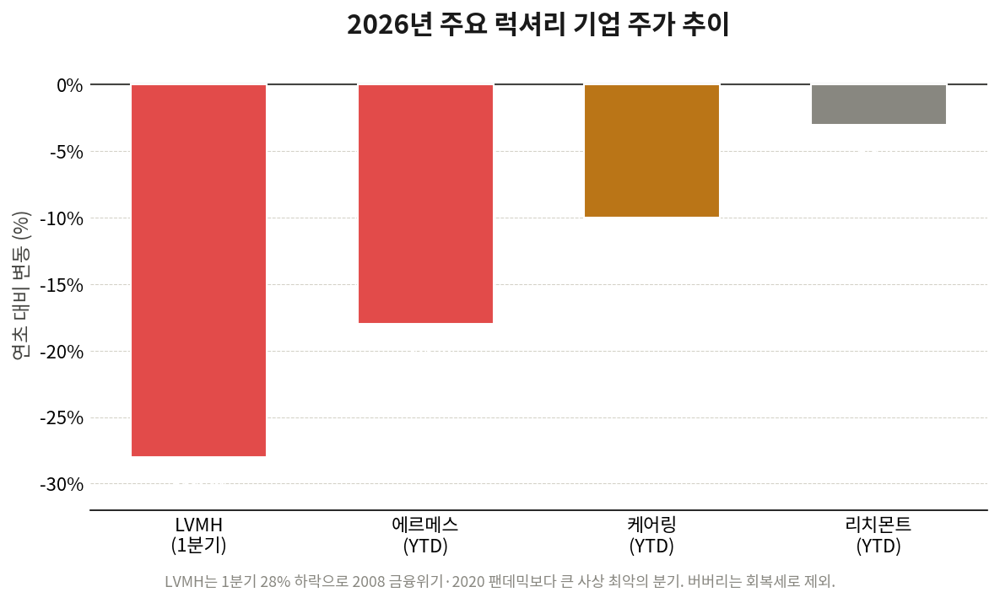

# [칼럼] 로고의 몰락

> 럭셔리 제국에 균열이 가기 시작한 진짜 이유 — 데이터로 다시 보다

**저자:** Dennis Kim (Cyworld 전 CEO, 베타랩스(Betalabs) 대표)
**작성일:** 2026-05-20

---

한때 부와 성공의 상징이었던 큼지막한 명품 로고가 이제 거리에 넘쳐나며 희소성을 잃고 있다. 2026년 들어 LVMH, 케어링(Kering), 에르메스 등 글로벌 럭셔리 기업의 주가가 급락하고 실적에 균열이 가기 시작한 것은 단순한 경기 불황 이상의 근본적인 패러다임 변화를 시사한다. 흥미로운 것은, 이 균열의 양상이 브랜드마다, 그리고 시점마다 전혀 다르다는 점이다. 이 칼럼은 그 차이를 데이터로 들여다본다.

## 1. MZ세대의 변심: '플렉스'에서 '실속'으로

명품 시장의 폭발적 성장을 견인했던 MZ세대의 소비 패턴이 급격히 변하고 있다. 이들은 '아버지 세대보다 돈을 못 버는 첫 세대'로 불리며, 팬데믹 이후 고물가·고금리 환경에서 자산 형성의 기회가 늦어지는 경제적 난관에 부딪혔다.

과거 무리해서라도 명품을 사며 자신을 과시하던 '플렉스(Flex)' 문화는 이제 지출을 극단적으로 줄이는 **'거지방' 열풍**과 **가성비 중심의 실속형 소비**로 대체되고 있다. 6만 원대 샤넬 립스틱 대신 3천 원짜리 다이소 화장품을 고르고, 새 제품 대신 중고 시장을 뒤지는 것이 이들에게는 더 '힙(Hip)'한 문화가 됐다.

> **[사례]** 미국에서는 이러한 흐름이 '언더컨슈머코어(Underconsumption-core)'라는 이름의 SNS 트렌드로 번졌다. 새 물건을 사지 않고 이미 가진 것을 끝까지 쓰는 모습을 자랑스럽게 공유하는 콘텐츠가 수억 회 조회되며, '많이 가진 것'이 아니라 '적게 쓰는 것'이 새로운 과시의 문법이 되었다. 명품 소비의 심리적 토대 자체가 흔들리고 있다는 신호다.

## 2. 제국 균열의 도화선: 신뢰의 붕괴와 가격의 역설

럭셔리 브랜드가 위기를 맞은 주요 원인은 다음 세 가지로 요약된다.

- **지나친 가격 인상:** 샤넬의 대표 가방인 클래식 플랩백 미디엄 가격은 10여 년 전 500만 원대에서 2024년 1,500만 원대까지 약 3배 가까이 올랐다. 일부 라인은 더 큰 폭으로 인상돼 소형차 한 대 값에 육박했다. 소비자들은 이제 "이 가격이 합당한가?"라는 의문을 던지기 시작했다.
- **원가 및 윤리 논란:** 2024년 6월, 이탈리아 밀라노 법원은 디올(Dior)의 이탈리아 하청 제조 자회사를 사법관리 대상으로 지정했다. 조사 결과 약 2,600유로(원화 약 360만 원)에 팔리는 가방의 하청 공급가가 단돈 53유로(약 8만 원)에 불과했고, 노동자들이 24시간 가동을 위해 작업장에서 잠을 자고 기계 안전장치가 제거된 정황이 드러났다. '장인 정신'이라는 명품의 핵심 가치에 치명타였다. 같은 해 아르마니(Armani) 역시 유사한 노동 착취 의혹으로 사법관리를 받았다.
- **중산층의 이탈:** 명품 제국을 실질적으로 지탱하던 '동경 소비층(aspirational buyers)'이 경기 침체로 지갑을 닫으면서, 입문용 제품(스카프, 향수, 소형 액세서리 등)의 매출이 급감했다. 베인앤컴퍼니에 따르면 글로벌 개인 명품 시장은 2025년 사실상 보합세에 그쳤다.

> **[핵심]** 중국 변수도 빼놓을 수 없다. 글로벌 명품 소비에서 중국이 차지하는 비중은 2019년 약 33%에서 2024년 약 21%로 가파르게 줄었다. 부동산 침체와 가계 부채 부담 속에 중국 소비자들이 소비보다 저축을 택하면서, 럭셔리 업계의 가장 강력했던 성장 엔진이 식어버린 것이다.

## 3. 조용한 럭셔리와 듀프(Dupe) 트렌드의 습격

시장은 이제 양극화된 새로운 트렌드에 직면해 있다.

- **조용한 럭셔리(Quiet Luxury):** 진짜 부자들은 누구나 알아보는 로고에 질려버렸다. 대놓고 드러내는 로고는 오히려 촌스럽다고 여기며, 아는 사람만 알아보는 은밀한 디테일과 고급 소재에 집중하는 브랜드로 이동하고 있다. 드라마 '석세션(Succession)'이 촉발한 로고 없는 캐시미어 코트, 브루넬로 쿠치넬리(Brunello Cucinelli) 같은 브랜드의 약진이 그 증거다. 실제로 쿠치넬리는 럭셔리 침체기에도 2026년 1분기 두 자릿수 성장을 기록했다.
- **듀프(Dupe) 트렌드:** 고가 브랜드와 디자인은 비슷하지만 가격은 훨씬 저렴한 '대체품'을 찾는 소비가 확산되고 있다. 미국 대형마트 월마트가 약 80달러에 내놓은 에르메스 버킨백 스타일의 가방, 이른바 '월킨(Walkin/Wirkin)백'이 출시 직후 완판된 사례는, 소비자들이 더 이상 로고값에 수천만 원을 지불하려 하지 않음을 상징적으로 보여준다.

## 4. 럭셔리 그룹의 엇갈린 성적표와 주가 추이

중산층의 소비 감소와 지정학적 충격은 주식 시장에 즉각 반영됐다. 다만 여기서 흔히 퍼진 오해를 바로잡을 필요가 있다. '케어링 주가 반토막'이나 '버버리 70% 폭락 후 지수 제외' 같은 이야기는 대부분 2023~2024년의 사건이며, 2026년의 그림은 이와 사뭇 다르다.

**2026년 1분기, 충격의 진앙은 의외로 LVMH였다.** 중동(이란) 전쟁으로 인한 관광 소비 위축과 환율 악재가 겹치면서, LVMH 주가는 1분기에만 약 28% 하락했다. 블룸버그 분석에 따르면 이는 2008년 글로벌 금융위기, 2020년 팬데믹, 2001년 닷컴 버블 당시보다도 큰, 1989년 이래 사상 최악의 연초 흐름이었다. 베르나르 아르노 회장은 투자자들에게 "2026년은 결코 쉽지 않을 것"이라고 경고했다.

**에르메스조차 예외가 아니었다.** 난공불락으로 여겨지던 에르메스도 2026년 1분기 매출이 시장 기대치를 밑돌았고, 실적 발표일 주가가 장중 10% 넘게 빠지며 52주 최저가에 근접했다. 연초 대비로는 약 18% 하락. '에르메스 신화'에도 균열이 확인된 순간이었다.

**반면 케어링과 버버리는 오히려 회복 신호를 보였다.** 구찌를 보유한 케어링은 신임 CEO 루카 데 메오(Luca de Meo) 취임 이후 회생 기대감으로 2026년 2월 실적 발표 당시 주가가 한때 14%까지 급등했다. 1분기 구찌 매출은 여전히 부진했지만, 시장의 시선은 4월 자본시장의 날에 공개된 회생 로드맵 'ReconKering'에 쏠렸다. 버버리 역시 2026 회계연도 결산에서 미주·중국 시장 두 자릿수 성장에 힘입어 '의미 있는 변곡점'을 선언하며 흑자 전환에 성공했다.

**주요 럭셔리 기업의 2026년 주가 흐름을 정리하면 다음과 같다.**

| 기업 (브랜드) | 2026 주가 흐름 | 핵심 동인 | 방향 |
| --- | --- | --- | --- |
| LVMH (루이비통·디올) | 1분기 약 -28% | 중동 전쟁·환율, 와인/주류 부진 | ▼ 급락 |
| 에르메스 (Hermès) | YTD 약 -18% | 실적 기대치 하회, 중동 둔화 | ▼ 하락 |
| 케어링 (Kering·구찌) | YTD 약 -7~14%, 변동성 큼 | 신임 CEO 회생 기대 vs 구찌 부진 | ↔ 등락 |
| 버버리 (Burberry) | FY26 흑자 전환 | 미주·중국 +10%, 헤리티지 회귀 | ▲ 회복 |
| 리치몬트 (까르띠에) | 상대적 견조 | 주얼리 수요 안정적 | — 보합 |

*\* 수치는 2026년 1~5월 보도 기준 근사값으로, 시점에 따라 변동될 수 있다.*

**한국 시장은 다소 상반된 모습을 보였다.** 지난해 샤넬코리아는 매출 약 2조 원, 루이비통코리아는 약 1조 8,543억 원, 에르메스코리아는 약 1조 1,251억 원으로 역대 최대 매출을 기록했다. 이는 가격 인상 전 선구매(panic buying) 수요와 하이엔드 제품에 대한 꾸준한 충성 수요 덕분이었다.

그러나 글로벌 전체로 보면 에르메스조차 실적 쇼크를 겪으며 럭셔리 제국의 균열이 분명히 확인되는 상황이다. 한국의 호실적은 추세의 반증이라기보다, 가격 인상이 만든 마지막 불꽃에 가깝다는 해석도 나온다.

## 5. '악마는 프라다를 입는다 2'와 패션의 현재

*(아래는 영화적 모티프를 빌린 해석적 서술이다.)* 영화 〈악마는 프라다를 입는다〉 속편에서 묘사될 법한 패션 잡지의 몰락은 현재 명품 시장의 상황과 묘하게 닮아 있다. 한때 우아함과 패션의 절대적 권위를 전파하던 잡지들은 이제 숏폼(Short-form) 콘텐츠에 잠식당했다.

이러한 레거시 플랫폼들은 더 이상 문화를 창조하는 주체가 아니라, 단순한 마케팅 창구로 전락했다. 명품 브랜드들 역시 깊이 있는 브랜드 철학보다 앰버서더를 활용한 숏폼 마케팅과 자극적인 로고 노출에 치중하며 스스로의 가치를 희석시켰다. 진정한 우아함이 사라진 자리를 얄팍한 마케팅이 채우면서, 대중은 명품으로부터 환상 대신 피로감을 느끼게 됐다.

---

## 맺으며: 가격이 아니라 가치를

2026년의 데이터가 말해주는 것은 분명하다. 럭셔리의 위기는 모든 브랜드에 똑같이 닥친 것이 아니라, 가격만 올리고 가치를 비운 브랜드일수록 더 깊게 흔들렸다는 사실이다. LVMH와 에르메스가 지정학·환율 충격에 휘청인 반면, 헤리티지로 회귀한 버버리와 명확한 회생 전략을 제시한 케어링은 시장의 신뢰를 일부 되찾았다.

로고로 자신을 증명하던 시대는 저물고 있다. 명품 브랜드들이 다시금 소비자의 마음을 돌리려면, 가격 인상이라는 손쉬운 길 대신 무너진 '진정한 가치'를 복원하는 것이 급선무다. 럭셔리 제국은 무너지지 않았다. 다만, 무엇으로 제국의 헤리티지와 가치를 지탱할 것인지 질문받고 있을 뿐이다.

---

## 참고 자료 및 레퍼런스

1. Bloomberg, "LVMH Shares Fell Most Ever in First Quarter on Luxury Slump" (2026.04)
2. CNBC, "LVMH Q1 sales miss / luxury recovery paused amid Middle East war" (2026.04)
3. CNBC, "Kering jumps as new CEO maps revival" (2026.02) / "Kering Q1 earnings" (2026.04)
4. CNBC, "Burberry stock — Americas and China demand boost turnaround" (2026.05)
5. Fortune / The Fashion Law, Dior 하청 노동 착취 및 53유로 원가 보도 (2024.06)
6. Bain & Company, 글로벌 개인 명품 시장 전망 (2025~2026)
7. TIN뉴스, '럭셔리 브랜드, 韓 최대 매출 찍다' (2026.04.14)

---

*© 2026 Dennis Kim · 본 칼럼의 주가·실적 수치는 2026년 1~5월 보도 기준 근사값이며, 한국 시장 매출 수치는 2차 출처(TIN뉴스) 인용으로 게재 전 원 출처 확인을 권장한다. 5장은 영화적 모티프를 빌린 해석적 서술이다.*
