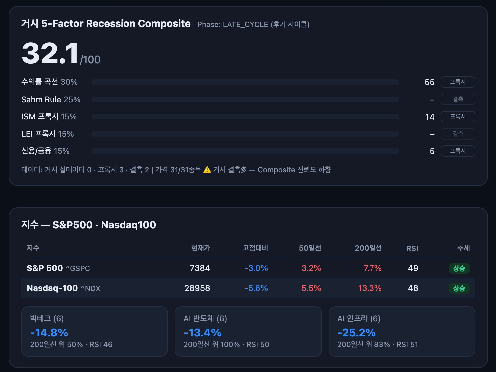
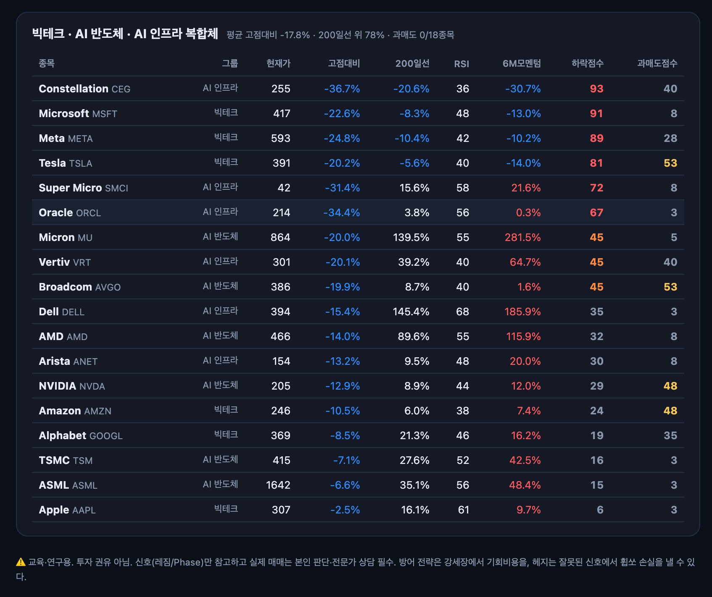
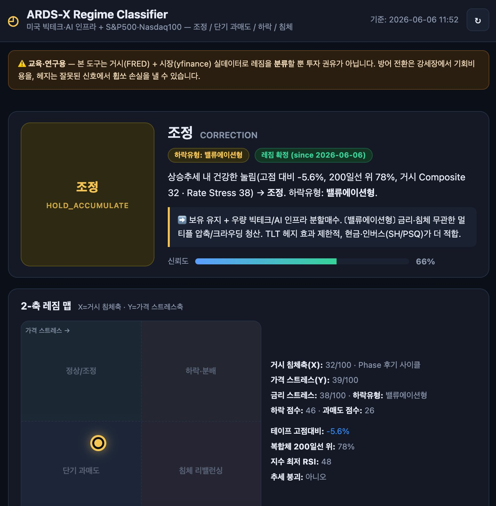
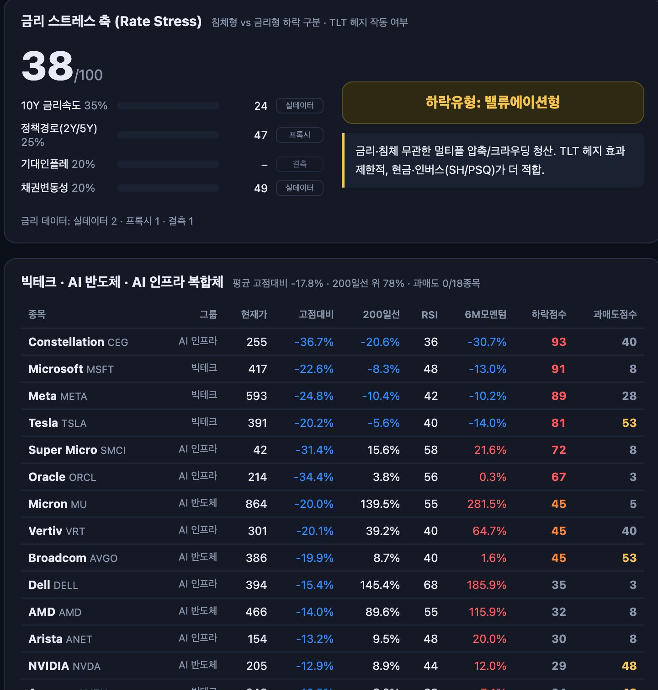

# 브로드컴은 48% 성장하고도 15% 폭락했다 — 이것은 침체가 아니라 '기대의 청산'이다

**ARDS-X 레짐 분류 기준 시황 분석 | 2026-06-06 | 김호광 (Dennis Kim), Betalabs Inc.**

> ⚠️ 교육·연구용. 투자 권유가 아닙니다. 본 칼럼의 레짐/신호는 분류일 뿐, 실제 매매는 본인 판단과 전문가 상담이 필요합니다.

---

## 1. 무슨 일이 있었나 — 트리거는 '나쁜 실적'이 아니었다

6월 3일 장 마감 후 브로드컴(AVGO)이 2분기 실적을 발표했다. 숫자만 보면 흠잡을 데 없다. 매출 221.9억 달러로 전년 대비 48% 성장, EPS 2.44달러로 컨센서스 상회. AI 반도체 매출은 분기 108억 달러로 두 배 이상 늘었다.

그런데 주가는 다음 날 15% 가까이 폭락하며 시가총액 3,000억 달러 이상을 지웠고, 금요일 나스닥 종합지수는 -4%로 2025년 4월 관세 쇼크 이후 최악의 하루를 기록했다. 필라델피아 반도체지수가 올해 들어 이번 주 전까지 약 90% 올랐다는 사실을 기억하자. 한국 KOSPI는 5거래일간 5% 하락하며 서킷브레이커가 발동됐고, 대만 가권도 3%대 조정을 받았다.

폭락의 직접 원인은 단 하나다. **3분기 AI 반도체 매출 가이던스 160억 달러가 월가 기대치 172억 달러에 못 미쳤고, CEO 혹 탄이 연간 AI 매출 목표를 상향하지 않았다는 것.** 48% 성장하는 기업이 '기대만큼 더 빨리 성장하지 않는다'는 이유로 하루에 3,000억 달러를 잃는 시장 — 이것이 크라우딩(crowding)된 트레이드의 청산 메커니즘이다. 실적이 아니라 **기대의 2차 미분**이 거래되고 있었던 것이다.

여기에 금요일 아침 5월 고용보고서가 기름을 부었다. 비농업 고용 +17.2만 명으로 예상치의 거의 두 배. 실업률은 4.3%로 안정적. 호르무즈 봉쇄발 유가 상승으로 인플레이션은 4%대로 재가속. 그 결과 10년물 국채금리는 4.53%, 30년물은 5%를 돌파했고, 연방기금선물 시장에서 **연내 금리 '인하'가 아니라 '인상' 확률이 43%까지 치솟았다.**

## 2. 데이터가 말하는 것 — ARDS-X v1.1 대시보드 스냅샷 (06-06 11:52 기준)

레짐 분류기를 돌려보면 그림이 의외로 명확하다.

**지수 레벨 — 아직 '조정' 영역이다.**

| 지수 | 현재가 | 고점대비 | 200일선 대비 | RSI | 추세 |
|---|---|---|---|---|---|
| S&P 500 | 7,384 | -3.0% | +7.7% | 49 | 상승 |
| Nasdaq-100 | 28,958 | -5.6% | +13.3% | 48 | 상승 |

테이프 고점대비 -5.6%는 통계적으로 평범한 눌림이다. 두 지수 모두 200일선 위에 있고, RSI는 48~49로 과매도 근처에도 못 갔다.

**그러나 표면 아래는 다르다 — 복합체 18종목 평균 고점대비 -17.8%.**

| 그룹 (6종목) | 고점대비 평균 | 200일선 위 비중 |
|---|---|---|
| 빅테크 | -14.8% | 50% |
| AI 반도체 | -13.4% | 100% |
| AI 인프라 | **-25.2%** | 83% |

지수가 -5.6%일 때 개별 빅테크·AI 종목은 이미 자체적인 약세장을 통과 중이다. 하락점수 상위를 보면 손상의 위치가 보인다: Constellation -36.7%(하락점수 93), Microsoft -22.6%(91), Meta -24.8%(89), Oracle -34.4%, Super Micro -31.4%. **전력·데이터센터·캐파 선행투자, 즉 'AI 인프라 체인'이 가장 깊게 깨졌다.** AI 캐펙스의 ROI 의심이 가장 직접적으로 가격에 반영되는 구간이기 때문이다. 반면 Apple -2.5%, ASML -6.6%, TSMC -7.1% — 현금흐름이 검증된 쪽은 거의 무사하다. 이것은 무차별 패닉이 아니라 **선별적 청산**이다.

**과매도는? 0/18 종목.** RSI 30 이하 진입 종목이 하나도 없다. 공포 구간이 아니라는 뜻이며, 동시에 '바닥 신호'도 아직 없다는 뜻이다.

**거시 — 5-Factor Recession Composite 32.1/100, Phase = 후기 사이클(Late-Cycle).** 수익률곡선 55, ISM 프록시 14, 신용/금융 5. 침체 경보 구간(50~70)이 아니라 그 아래다.

종합하면 2-축 레짐 맵의 좌표는 **거시 침체축 32 / 가격 스트레스축 39 → '조정(CORRECTION)', 신뢰도 66%, 처방은 HOLD_ACCUMULATE**다. v1.1부터 도입된 히스테리시스(진입/이탈 밴드 + N일 확인) 기준으로도 **레짐 확정(since 2026-06-06)** 상태다.

**그렇다면 이 하락의 '원인'은 무엇인가 — 새로 추가된 금리 스트레스 축이 답한다.**

이번 분석부터 분류기에 **Rate Stress 서브컴포지트**(10Y 금리속도 35% + 정책경로 2Y/5Y 25% + 기대인플레 20% + 채권변동성 20%)가 추가됐다. "침체 Composite는 낮은데 왜 떨어지나"라는 질문에 시스템이 스스로 답하게 만들기 위해서다. 결과는 의외였다.

**Rate Stress 38/100 — 금리형 임계치(55)에 못 미친다.** 세부를 보면 10Y 금리속도 점수가 24에 불과하다. 금요일 10년물이 4.53%로 뛰었다고는 해도 20일 누적 변화로 보면 2022년형 금리 쇼크와는 차원이 다른 속도라는 뜻이다. 정책경로 47, 채권변동성 49 — 모두 경계 수준이지 위기 수준이 아니다.

그래서 분류기의 판정은 **침체형도, 금리형도 아닌 '밸류에이션형(VALUATION_DRIVEN)'**이다. 거시 Composite 32 < 55, Rate Stress 38 < 55 — 둘 다 하락을 설명하지 못하므로, 남는 범인은 멀티플 압축과 크라우딩 청산뿐이다. 1장에서 정성적으로 말한 '기대의 2차 미분 청산'을 정량 시스템이 독립적으로 재확인한 셈이다. 처방도 따라 바뀐다: **밸류에이션형 하락에서 TLT 헤지는 효과가 제한적이고, 현금·단기물·인버스(SH/PSQ)가 더 적합하다.**

## 3. 정직한 각주 두 개 — 모델을 믿기 전에

여기서 멈추면 반쪽짜리 분석이다. 두 가지를 짚어야 한다.

**첫째, Composite 32.1의 데이터 품질이 낮다.** 이번 스냅샷은 거시 실데이터 0개, 프록시 3개, 결측 2개(Sahm Rule, LEI)로 산출됐다. 대시보드 스스로 "Composite 신뢰도 하향"을 띄우고 있다. Sahm Rule이 결측인 상태의 침체 컴포지트는 핵심 센서가 빠진 화재경보기다. 32라는 숫자를 '침체 위험 낮음'으로 단정하면 안 되고, '현재 가용 데이터 기준 침체 신호 미점등' 정도로 읽어야 한다.

**둘째, 3주 전 ARDS 4-LLM 스냅샷(5/17)은 Composite 61, Phase 3 Recession-Warning이었다.** 같은 프레임워크가 61 → 32로 이동한 것은 거시가 갑자기 좋아져서가 아니라, 데이터 가용성과 입력 구성이 달라졌기 때문이기도 하다. 그리고 실제 거시 뉴스플로우는 흥미롭게도 모델 하향과 같은 방향이다 — 고용 +17.2만은 침체 시나리오를 직접 기각한다. 다만 여기서 "그럼 적은 금리다"로 직행하면 한 단계를 건너뛰는 것이다. 금리는 분명 금요일 매도의 **트리거**였지만, Rate Stress 38이 보여주듯 충격의 **크기**는 금리형 하락의 기준에 못 미친다. 인상 확률 43%는 아직 '가능성'이지 '가격에 다 반영해야 할 현실'이 아니다. 트리거(금리 뉴스)와 동력(밸류에이션 청산)을 구분하는 것 — 이것이 금리 축을 추가한 이유다. 물론 이 신축 자체도 기대인플레(브레이크이븐) 결측 1개를 안고 있다는 점은 같은 잣대로 적어 둔다. 그리고 인상 확률이 실제로 60%를 넘어 Rate Stress가 55를 돌파하면, 하락유형 라벨은 금리형으로 갱신되고 TLT/IEF 처방은 정반대로 뒤집힌다. 30년물 5%가 그 경계의 감시선이다.

"LLM은 엑셀이지 오라클이 아니다." 모델의 출력은 입력의 함수다. 결측이 많은 날의 컴포지트 점수는 겸손하게 다뤄야 한다.

## 4. 로테이션의 증거 — 시장은 죽지 않았다, 이동했다

이번 주의 가장 중요한 단서는 나스닥이 아니라 다우에 있다. 기술주가 폭락하는 동안 **다우는 51,600선에서 사상 최고치를 경신했다.** 유나이티드헬스, 골드만삭스, JP모건, J&J가 주도했고, 2026년 들어 산업재·필수소비·에너지가 시장을 아웃퍼폼 중이다. 2년간 AI에 가려 있던 섹터로 자금이 이동하는 전형적인 로테이션이다.

유동성 전체가 시장을 떠나는 국면(2022년형)과, 한 트레이드에서 다른 트레이드로 이동하는 국면(현재)은 대응이 완전히 다르다. 전자는 현금 비중의 문제고, 후자는 **포지션 구성의 문제**다. ARDS 4-Tier로 번역하면: Tier 3 퀄리티 방어주(BRK-B, WMT, JNJ, COST 류)가 이미 시장의 선택을 받고 있고, Tier 2 중에서는 금리 인상 리스크 때문에 장기듀레이션(TLT)보다 단기물(SHV, BIL)과 금(GLD)의 상대 매력이 높아진 구간이다.

## 5. 시나리오와 트리거 — 무엇을 보고 갈아탈 것인가

레짐 분류기의 현재 답은 '조정 내 보유 + 분할매수'다. 그러나 레짐은 상태이지 예언이 아니다. 전환 트리거를 명시해 둔다.

**조정 → 과매도 반등(OVERSOLD_BOUNCE) 전환 조건:** 복합체 과매도 종목 수가 0에서 의미 있게 증가(RSI 30 이탈 종목 출현), 지수 RSI 35 이하. 이 경우 분할매수 강도를 높이는 신호다. 역설적이지만 **지금 시장은 더 떨어져야 더 좋은 매수 기회가 된다.** 0/18 과매도는 '아직 싸지 않다'는 뜻이다.

**조정 → 하락·분배(DOWNTURN) 전환 조건:** 지수의 200일선 이탈 + 복합체 200일선 위 비중 78% → 50% 미만 붕괴, 또는 거시 Composite의 50 돌파(특히 결측 중인 Sahm Rule·LEI가 채워지면서 점프하는 경우). 추가로 **금리 인상 확률 43% → 60%+ 진입과 함께 Rate Stress가 55를 돌파하면 하락유형이 밸류에이션형 → 금리형으로 갱신되고, 밸류에이션 리프라이싱이 2차전에 들어간다.** 다음 CPI와 FOMC가 분기점이다.

**무효화 조건(상방):** 브로드컴 쇼크가 단발 이벤트로 소화되고 나스닥-100이 신고가를 회복하면, 이번 주는 2024년 8월·2025년 4월과 같은 '강세장 내 며칠짜리 발작' 목록에 추가된다.

## 6. 결론

이번 하락의 본질은 세 줄로 요약된다.

1. **실적 쇼크가 아니라 기대 쇼크다.** 48% 성장이 '실망'으로 거래되는 것은 크라우딩의 정의 그 자체이며, 12월 브로드컴 백로그 우려 때부터 누적된 'AI 기대 인플레이션'의 첫 본격 청산이다. 새로 추가된 금리 축이 이를 정량적으로 확인했다 — 거시 32, Rate Stress 38, 둘 다 임계치 미달. **하락유형: 밸류에이션형.**
2. **트리거는 금리, 동력은 밸류에이션이다.** 고용은 강하고 인플레는 재가속 중이지만 금리 충격의 절대 속도(10Y 속도 점수 24)는 아직 쇼크가 아니다. 따라서 방어 포트폴리오도 2025년형(인하 베팅 + 장기채 TLT)이 아니라 2026년형 — 현금·단기물(SHV/BIL) + 금 + 퀄리티 방어주 + 로테이션 수혜 — 으로 짜야 한다. Rate Stress 55 돌파 시 이 처방은 다시 갱신된다.
3. **레짐은 아직 '조정'이다 — 단, 신뢰도 66%짜리 조정이다.** 지수는 멀쩡하고 과매도는 비어 있다. 패닉할 데이터도, 전력 질주로 매수할 데이터도 없다. 트리거를 정해 두고 기다리는 것이 이 좌표에서의 정답이다.

시장은 지금 "AI가 거짓말이었나?"를 묻는 게 아니다. "AI에 지불한 가격이 맞았나?"를 묻고 있다. 두 질문의 답은 다를 수 있다.

---

*데이터: ARDS-X Regime Classifier v1.1 (FRED + yfinance 실데이터, 2026-06-06 11:52 KST 스냅샷 · 금리 스트레스 축 + 히스테리시스 + Brier 캘리브레이션 반영) · 프레임워크: [vibe-investing/ARDS-X](https://github.com/gameworkerkim/vibe-investing/tree/main/01.Trading%20Strategy/ARDS%20%E2%80%94%20Adaptive%20Recession-Defensive%20Strategy%20for%20AI_QQQ) · 뉴스 출처: CNBC, Bloomberg, Investopedia/AOL, indmoney (2026-06-04~06)*

*⚠️ 본 칼럼은 교육·연구 목적이며 투자 권유가 아닙니다. 방어 전환은 강세장에서 기회비용을, 헤지는 잘못된 신호에서 휩쏘 손실을 낼 수 있습니다.*
