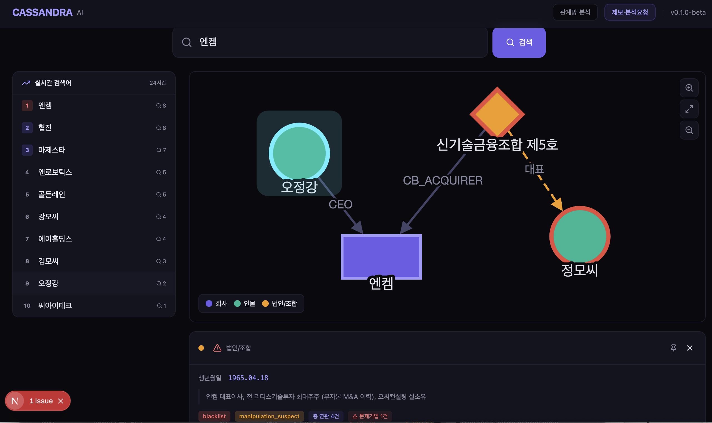

# CASSANDRA AI

> **LLM-Powered Distressed Company Disclosure Intelligence**
>
> 코스닥 시장의 소음 속에서 이상 징후 신호를 찾아내고, LLM이 관계망을 분석하여 하나의 흐름으로 재구성하는 공익 목적의 분석 시스템입니다.

---

## 개요

**CASSANDRA AI**는 금융감독원 전자공시시스템(DART)에 제출된 공시 데이터를 실시간으로 수집하고,
DeepSeek·Claude 등 다중 LLM을 활용하여 개인·법인·조합 간의 **연관 관계를 분석**합니다.

공시 정보, 뉴스 검색, 주식 거래량 데이터를 종합하여 비정상적인 거래와 공시의 흐름 속에서
**이상 징후를 추론**하고 이를 **리포트 형태로 가시화**합니다.



> ※ 본 시스템은 공시된 사실 정보를 색인·분석하는 도구이며, 특정 개인이나 법인에 대한 평가가 아닙니다.
> 모든 데이터는 DART 원본 공시(접수번호)로 역추적 가능합니다.

## 핵심 기능

### 1. 관계망 분석
- 회사명·인물명·법인명으로 실시간 검색
- Cytoscape.js 기반 인터랙티브 관계망 그래프
- 노드 클릭 시 상세 정보: 연관도, 참여 기업, CB/BW 자금조달 이력, 탐지 신호

### 2. 이상 징후 탐지
- CB 전환가액 반복 하향(리픽싱), 최대주주 변경 + CB 발행 + 사업목적 추가 결합 패턴
- 페이퍼컴퍼니·SPC를 통한 무자본 M&A 구조
- 감사의견 거절·한정, 감사인 반복 변경
- 동일 인물·법인의 다수 한계기업 반복 등장

### 3. 핀보드 & 리포트
- 관심 인물·법인·회사를 핀(pin)으로 고정
- 핀된 엔티티의 연관 기업을 자동 검색하여 **이상 징후 분석 리포트** 생성
- MD(Markdown) 형식 다운로드 지원

### 4. 집단 지성 평가
- 인물·법인·회사에 대한 👍/🤷/👎 투표 시스템
- 집단 평가 기반 악의 지수(malice score) 산출
- **사용자들의 집단 지성이 한국 주식 시장의 부정 행위를 줄이는 데 기여합니다**

### 5. 위키 스타일 정보 축적
- 특정 인물·법인·회사 페이지에 관련 공시, 사건, 뉴스를 위키 형태로 축적
- 기자·검사·경찰 등 검증된 사용자의 평가와 평판 정보를 통합
- 실소유자(바지)와 주세력 간의 관계망을 시각화

## 기술 스택

| 계층 | 기술 |
|---|---|
| **프레임워크** | Next.js 15 (App Router) |
| **언어** | TypeScript |
| **데이터베이스** | PostgreSQL 16 + TimescaleDB (시계열) |
| **ORM** | Prisma 6 |
| **관계망 시각화** | Cytoscape.js |
| **스타일링** | Tailwind CSS 4 |
| **LLM (계획)** | DeepSeek V3 + Claude Sonnet 4 (다중 앙상블) |
| **외부 API** | OpenDART (금융감독원), Toss Securities Open API (계획) |
| **상태 관리** | Zustand |

## 데이터 소스

| 소스 | 용도 |
|---|---|
| **DART OpenAPI** | 공시 목록, 사업보고서, 감사보고서, 주요사항보고서, 지분공시 |
| **Toss Securities Open API** (연동 계획) | 실시간 주가, 거래량, 호가 데이터 |
| **뉴스 검색** (연동 계획) | 기업·인물 관련 뉴스 크로스레퍼런스 |
| **KIND (한국거래소)** | 상장폐지 종목, 관리종목 지정 이력 |

## 데이터 모델

```
Corp ──< CorpPersonRelation >── Person
Corp ──< CorpFundRelation   >── Fund
Fund ──< FundPersonRelation >── Person
Corp ──< Filing (공시)
Corp ──< Signal (이상 신호)
Person ──< SameNameGroup (동명이인 구분)
Entity ──< EntityVote (집단 평가)
```

## 탐지 신호

| 신호명 | 조건 | 가중치 |
|---|---|---|
| `MA_CB_NEW_BIZ_180D` | 최대주주변경 + CB발행 + 사업목적추가 결합 | 0.85 |
| `CB_REFIX_CHAIN` | CB 전환가액 2회 이상 하향 | 0.78 |
| `CB_ACQUIRER_RECURRENCE` | 동일 인수자의 다수 한계기업 CB 인수 | 0.90 |
| `CB_EXCESSIVE_ROUNDS` | CB/BW 3회차 이상 발행 | 0.72 |
| `CB_ISSUE_SELL_LOOP` | CB 발행 후 매각 반복 | 0.74 |
| `CB_CALL_RECYCLE` | 콜옵션 회수 + 신규 CB 발행 | 0.76 |
| `CB_RAPID_FIRE` | 6개월 내 CB 재발행 | 0.70 |
| `FUND_SHELL_ACQUIRER` | 자본금 미미 SPC의 대규모 인수 | 0.78 |
| `NO_CAPITAL_MNA` | 인수대상 자산 담보 차입 → 무자본 M&A | 0.95 |
| `REPEAT_DIRECTOR_DISTRESSED` | 등기임원의 다수 한계기업 이력 | 0.70 |

## 시작하기

```bash
git clone https://github.com/gameworkerkim/cassandra-ai.git
cd cassandra-ai
npm install

# PostgreSQL 실행 후
createdb dart_monitor
npx prisma migrate dev --name init

# DART API 키 설정 (터미널 입력)
npm run setup

# 개발 서버 실행
npm run dev
# → http://localhost:3000
```

## 프로젝트 구조

```
cassandra-ai/
├── prisma/
│   ├── schema.prisma         # DB 스키마 (11개 모델)
│   ├── seed.template.ts      # 시드 템플릿 (공개용)
│   └── seed.ts               # 백테스팅 데이터 (로컬 전용, .gitignore)
├── src/
│   ├── app/
│   │   ├── page.tsx          # 홈: 검색 + 관계망 + 핀보드
│   │   ├── report/page.tsx   # 이상 징후 분석 리포트
│   │   ├── board/page.tsx    # 제보·분석요청 게시판
│   │   ├── api/search/       # 통합 검색
│   │   ├── api/graph/        # 관계망 그래프 데이터
│   │   ├── api/report/       # 리포트 생성
│   │   ├── api/vote/         # 집단 평가 투표
│   │   ├── api/samename/     # 동명이인 조회
│   │   └── api/detail/       # 엔티티 상세
│   ├── components/
│   │   ├── EntityGraph.tsx    # Cytoscape.js 관계망
│   │   ├── TrendingSearches.tsx  # 실시간 검색어
│   │   ├── PinboardPanel.tsx  # 핀보드
│   │   ├── VoteWidget.tsx     # 집단 평가 투표
│   │   └── BoardPage.tsx      # 게시판
│   └── lib/
│       ├── prisma.ts
│       ├── graph-queries.ts
│       ├── export-report.ts   # MD 리포트 생성
│       └── pinboard-store.ts  # Zustand 핀보드
├── scripts/setup-key.js      # DART API 키 설정
├── docker-compose.yml        # PostgreSQL + TimescaleDB
└── README.md
```

## 로드맵

- [x] **v0.1.0** — 관계망 그래프 + 검색 + 샘플 데이터
- [x] **v0.2.0** — 실시간 검색어, 핀보드, 리포트 생성
- [x] **v0.3.0** — 동명이인 구분, 집단 평가 투표, 게시판
- [ ] **v0.4.0** — OpenDART 실시간 폴링 연동
- [ ] **v0.5.0** — DeepSeek + Claude LLM 분석 파이프라인
- [ ] **v0.6.0** — Toss Securities Open API 연동 (거래량 분석)
- [ ] **v0.7.0** — 뉴스 크로스레퍼런스
- [ ] **v0.8.0** — 회원 가입 (Google/Naver 이메일 인증)
- [ ] **v0.9.0** — 기자·검사·경찰 검증 사용자 평가 시스템
- [ ] **v1.0.0** — 위키 형태 정보 축적 + TimescaleDB 시계열 군집 분석

## 주의사항

### 법적 고지

1. 본 서비스는 금융감독원 전자공시시스템(DART)에 **공시된 사실 정보를 색인·분석**하여 제공하는 공익 목적의 도구입니다.
2. 특정 개인·법인에 대한 **평가적 표현을 포함하지 않으며**, 투자 권유가 아닙니다.
3. 본 서비스에서 제공되는 정보는 공시 제출인의 책임 하에 작성된 것으로,
   금융감독원이 그 정확성 및 완전성을 보장하지 않습니다.
4. 이용자는 본 정보를 투자 판단의 근거로 사용해서는 안 되며,
   이를 위반하여 발생한 손실에 대해 서비스 제공자는 민·형사상 책임을 부담하지 않습니다.
5. 모든 데이터는 DART 원본 공시(접수번호)로 역추적 가능합니다.

### 데이터 보안

- **백테스팅 데이터(`prisma/seed.ts`)는 `.gitignore` 에 포함되어 GitHub에 업로드되지 않습니다.**
- 실제 인물·법인에 대한 평가 데이터는 로컬 환경에서만 관리됩니다.
- 공개 저장소에는 익명화된 템플릿(`prisma/seed.template.ts`)만 제공됩니다.

## 관련 링크

- [DART 전자공시](https://dart.fss.or.kr)
- [OpenDART API](https://opendart.fss.or.kr)
- [KIND 한국거래소](https://kind.krx.co.kr)
- [Toss Securities Open API](https://tossinvest.github.io/)
- [가설 문서 (Hypothesis)](https://github.com/gameworkerkim/vibe-investing/tree/main/LLM%EC%9D%84%20%EC%9D%B4%EC%9A%A9%ED%95%9C%20%ED%95%9C%EA%B3%84%EA%B8%B0%EC%97%85%20%EA%B3%B5%EC%8B%9C%20%EC%B6%94%EC%A0%81%20%EC%8B%9C%EC%8A%A4%ED%85%9C)

## License

본 프로젝트는 공익 목적으로 개발되었습니다. 구체적인 라이선스는 추후 결정됩니다.

---

> *"시장의 소음 속에서 진짜 신호를 찾아내는 것. 그것이 카산드라의 사명입니다."*
>
> *— CASSANDRA AI Team*
